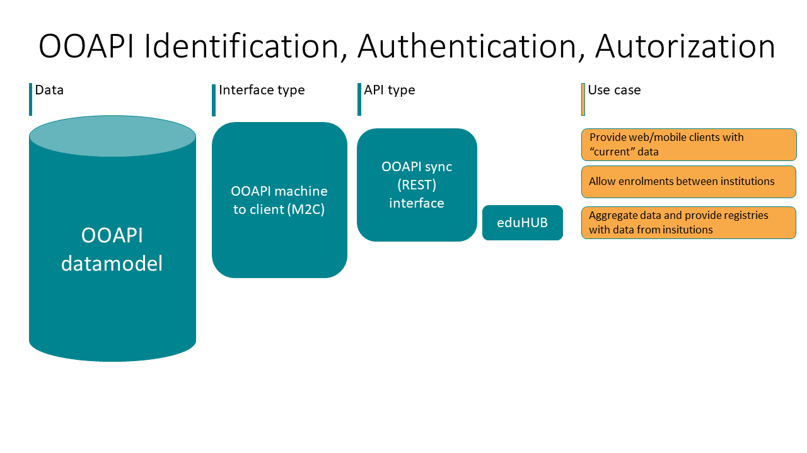

# IAA (Identification, Authentication and Authorization) 

Even though the name Open Education API would suggest all data provided by an API is open to the public, this should not be the case. The implementation of the different OOAPI requests and responses require different types of security. 

A usual implementation of OOAPI exposes internal (data) service endpoints for external consumption. This can be either through additional aggregation, eg. OOAPI gateway, or directly form the OOAPI endpoints form institutions (e.g. University of Leiden, or inHolland). The next figure provides an overview of components that are usually used.

## IAA not in scope of the specification
To optimize the use and adoption of the Open Education API (with the focus on providing a standardized API based on the underlying semantic data model), the specification does not prescribe a specific authentication & authorisation method. While having a clear stance and a prescriptive choice in this area could be valuable for parties implementing the API technically, we also recognize that it could hinder adoption. For this reason, we aim to recommend a proven, widely supported, and easy-to-implement authentication standard.

## Minimal level of classification
Since the current OOAPIv5 implementation only provides information on a REST API, based on the [open API specification 3.0](https://swagger.io/specification/). We suggest API endpoints that have CIA (Confidentiality, Integrity, Availability) scores above 'LLL' to implement security measures for accessing the endpoints. The types of security measures would depend on the sensitivity of the types of data exposed by the endpoint.

## Internet standards for Identification and authentication 
To ensure secure data exchange, we recommend using an open and dominant standard that is actively being developed. Proper implementation and use of a security standard are crucial. Choosing an open and widely used standard ensures broad support from vendors and/or the availability of sufficient libraries for correct implementation, ultimately achieving the main goal: secure data exchange. The dutch ‘forum standaardisatie’ (https://www.forumstandaardisatie.nl/) is a valuable resource for consulting advice on the use of open standards.

Based on the above, we recommend the OAuth2 protocol, an open standard developed and maintained within the IETF.
For machine-to-machine (M2M) data exchange (where user authorization is not required), we recommend, as a best practice, using the OAuth2 client credentials grant type for authenticating and authorizing the client to access the data: https://oauth.net/2/grant-types/client-credentials

For an implementation requiring delegated user access for approving data processing, we recommend using the OpenID Connect flow, based on the OAuth2 authorization code flow: https://openid.net/developers/how-connect-works

For both flows, we recommend supporting both JWT and reference tokens for access tokens.

[SURFConext also provides OIDC](https://servicedesk.surf.nl/wiki/spaces/IAM/pages/128910009/Tutorials). The OpenID Connect authentication flow supported by SURFconext can be found in the [SURFConext wiki](https://servicedesk.surf.nl/wiki/spaces/IAM/pages/128910041/OpenID+Connect+authentication+flow)

## Authorization at multiple levels

For handling authorization this is usually either business rule based which would be handled in the data services themselves or in the API manager when rules pertain to: 
* device
* key
* IP range 
* Throttling 

Of course the API manager itself could also have additional security measurements, such as firewalls, whitelisting for specific endpoints or Access Control Lists 

In the OOAPI IAA efforts we conform to the [IAA vision of SURF](https://communities.surf.nl/trust-en-identity/artikel/surfnet-visie-op-iaa-transitie-naar-gebruiker-centraal)

In the eduXchange project the OAuth token of the student is used to exchange information on their behalf.  

