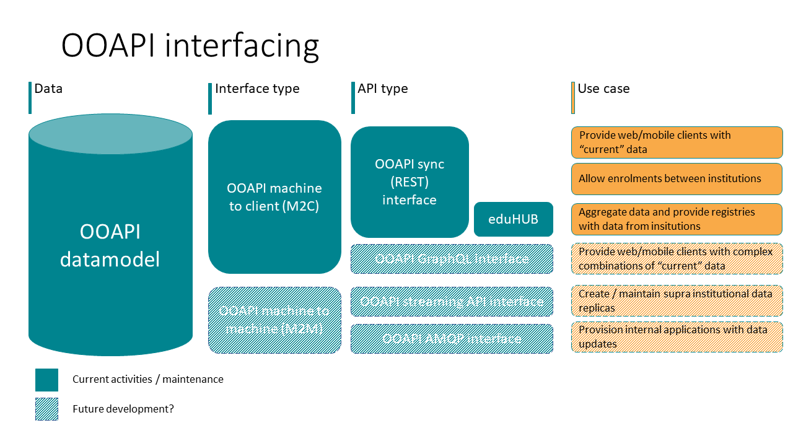

# OOAPI data exchange and relations with other specifications
OOAPI is currently developed as part of a three layer approach
Data –> interface type –> API realisation. A realisation also has a usecase.

Currently, there is one API realisation available: the REST interface. The current rest interface is a further detail of the overall OOAPI data model. In some cases the data model has been comprised to make end points easier to consume, for example the aggregated type of education is not available as an endpoint only the three specific forms, program, course and component. For offerings a different approach has been chosen mostly to make the relation with an association reusable. The REST interface has been creates based on the [REST-API-Desgin-rules](https://forumstandaardisatie.nl/open-standaarden/rest-api-design-rules). 

The OOAPI specification itself is NOT an API. It is a specification that is provided to the public for implementation by educational institutions. Currently, SURF is performing tests and live implementations of the OOAPI specification in an API for the OOAPI-gateway and a course exchange. 

In the development of the OOAPI data model and REST specification special attention was given to existing IMS and European standardisation activities, such as ECTS course catalogue, IMS OneRoster, IMS LIS and IMS edu API. There has also been information exchange with RIO and HOVI development. Because of different use cases, E.g. HOVI focuses more on marketing and communication data there is no complete match. 

Where possible a match has been made. 

These matches are:
* Implementation of the ECTS guidelines and mapping of these elements can be found [here](https://github.com/open-education-api/specification/blob/master/docs/_media/OOAPIv50_ECTS_course_catalogue_elementen.xlsx?raw=true)
* Comparisons between HOVI v2 and OOAPI v4 can be found [here](https://github.com/open-education-api/specification/blob/master/docs/_media/Vergelijking_HOVI_API_v2_OOAPIv50.docx?raw=true) and [here](https://github.com/open-education-api/specification/blob/master/docs/_media/Vergelijking_HOVI_API_v2_OOAPIv50_veldniveau.xlsx?raw=true)
* A comparison between RIO HO is part of the current consumer information and can be found [here](technical/consumers-and-profiles/rio)

## Link with policies and other standards:
The development of the OOAPI has also been influenced by existing standards and regulations based on the Dutch [comply or explain / pas toe of leg uit list](https://www.forumstandaardisatie.nl/open-standaarden/verplicht). For the development the ["digikoppeling"](https://www.logius.nl/diensten/digikoppeling/documentatie) has been used as a guideline. For the development the following elements were taken into account:
* [Digikoppeling Restful API Profiel](https://publicatie.centrumvoorstandaarden.nl/dk/restapi/)
* [REST-API Design Rules (Nederlandse API Strategie IIa) 1.0](https://publicatie.centrumvoorstandaarden.nl/api/adr/)
    * Deviation: endpoint (API-04) and documentation (API-017) language English. This was chosen due to the international context in which HE institutions operate.
