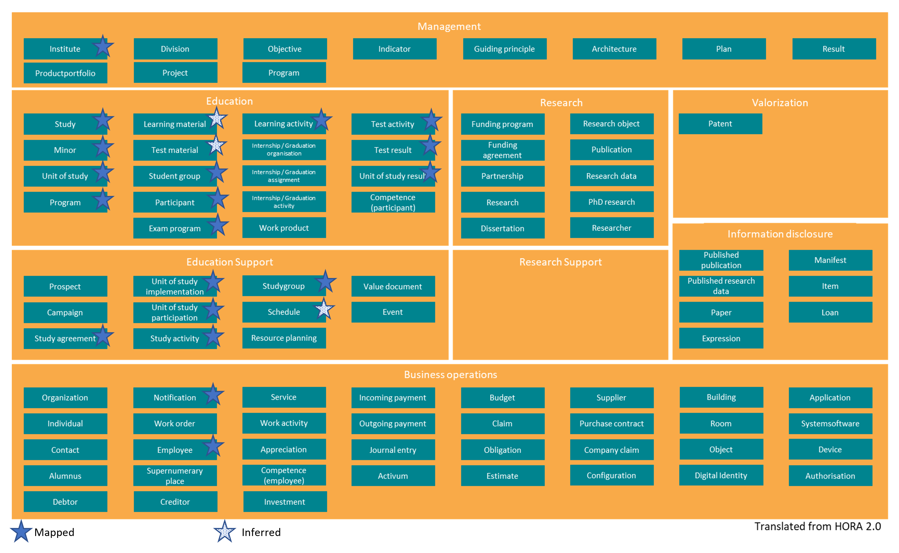
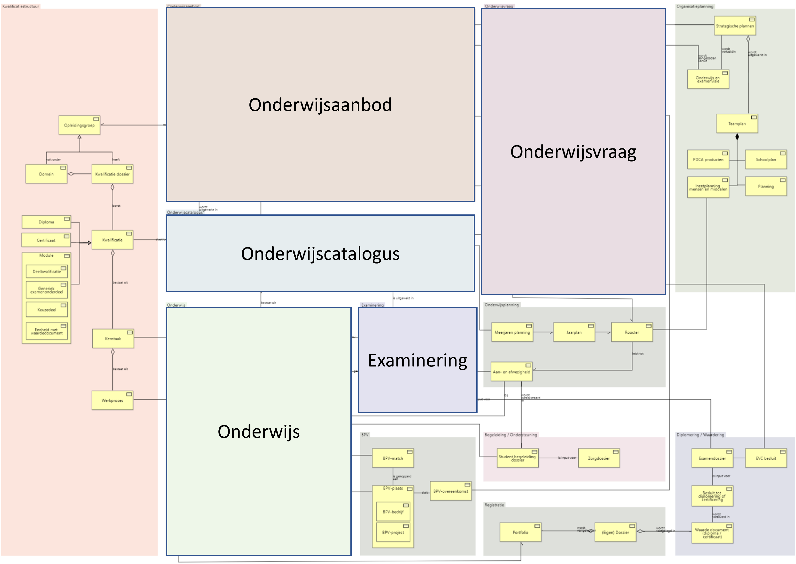

# OOAPI scope

The OOAPI specification is aimed at providing information related to student activities and the general information needs of students.

Examples of use of the OOAPI are:

* Detailed information on courses that are available at an institution on a shared website;
* Rostering information for a student on a student app;
* Course results in a student app;

The current implementation of OOAPI is aimed at data in transit. It provides information that is currently available and can be aggregated from within an educational institution. In the current iteration of the OOAPI we are not focusing on historical data nor versioning of a given data element.

Specifically for the RIO implementation, historical data is now also being made available.

The current scope of the OOAPI as mapped to the [HORA](https://www.surf.nl/hoger-onderwijs-referentie-architectuur-hora) information objects is shown in the figure below:

## OOAPI domains

The focus of the OOAPI specification is on providing

information in the following [HORA](https://www.surf.nl/hoger-onderwijs-referentie-architectuur-hora) domains:

* Education
* Education support

For future use the OOAPI has also been mapped to the [MORA](https://mbodigitaal.nl/mora/) information model:

Where the OOAPI maps to:

* Education offering
* Course catalogue
* Education 
* Education demand
* Exams/Testing
