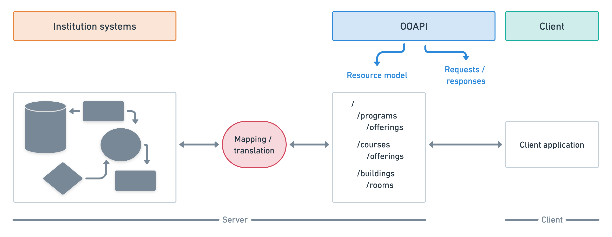

# Introduction

## About REST
The OOAPI specification is based on the REST architectural style to design API's. The REST architectural style is centered around the concept of a resource. A resource is the key abstraction of information, where every piece of information is named by assigning a globally unique URI (Uniform Resource Identifier). Resources describe things, which can vary between physical objects (e.g. a building or a person) and more abstract concepts (e.g. a permit or an event). Because resources describe things (and thus not actions), resources are referred to using nouns (instead of verbs) that are relevant from the perspective of the user of the API.

A resource describing a single thing is called a singular resource. Resources can also be grouped into collections, which are resources in their own right and can typically be paged, sorted and filtered. Most often all collection members have the same type, but this is not necessarily the case. A resource describing multiple things is called a collection resource. Collection resources typically contain references to the underlying singular resources.

Since OOAPI describes the information of an institution as resources, each institution that wants to create an OOAPI implementation has to define their own mapping/translation between the OOAPI resources and their own internal data model.

## The specification
The actual OOAPI specification is specified using the [Open API Specification](https://www.openapis.org/), a standard that specifies how to specify (among other things) REST API's. The detailed OOAPI specifications can be found here:

* [OOAPI v5](https://open-education-api.github.io/specification/v5/docs.html) (Current version)

These are the previous versions:

* [OOAPI v4](https://open-education-api.github.io/specification/v4/docs.html) (limited support)
* [OOAPI v3](https://open-education-api.github.io/specification/v3/docs.html) (unsupported)
* [OOAPI v2](https://open-education-api.github.io/specification/v2/docs.html) (unsupported)
* [OOAPI v1](https://open-education-api.github.io/specification/v1/docs.html) (unsupported)
