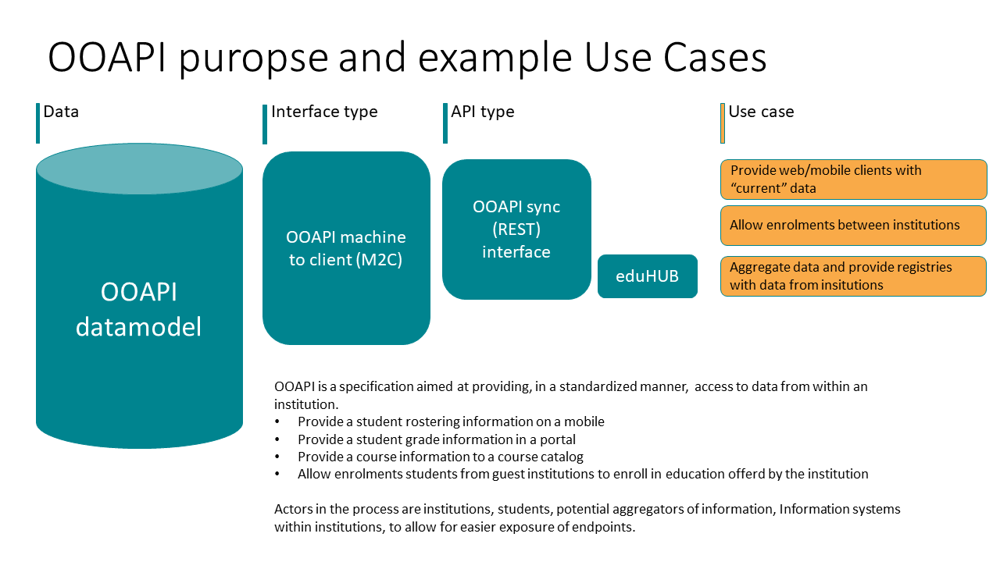
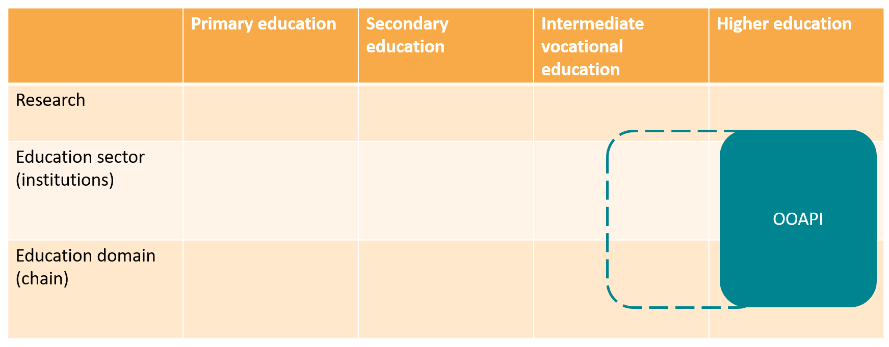
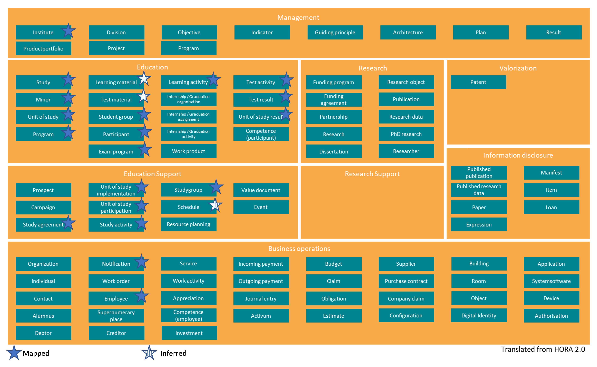
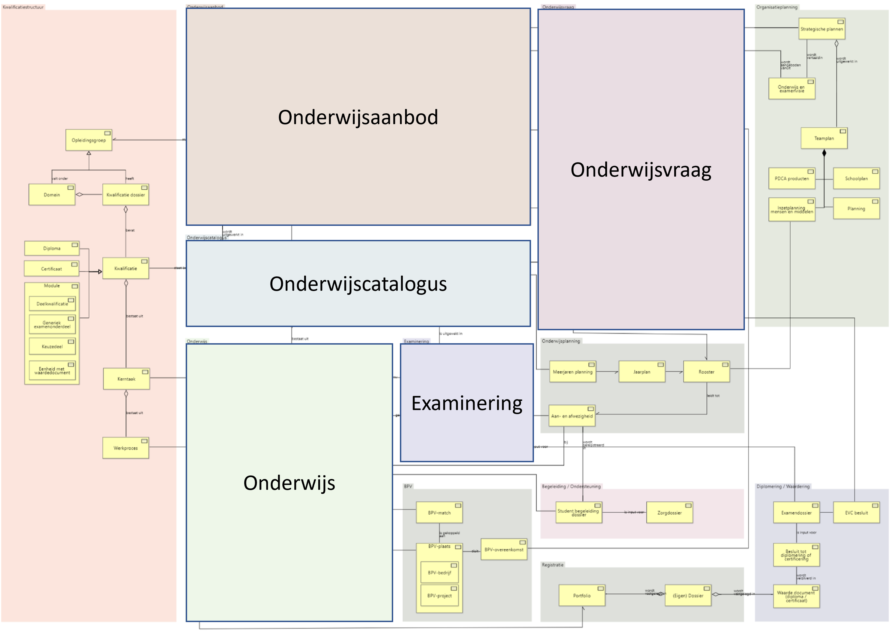

# Architecture

To facilitate future ROSA scans, additional information is provided
about the OEAPI specification.

A general overview of the rationale behind the specification and how it
relates to other elements is provided, using the ROSA scan
structure.

## OEAPI Purpose

The aim of the OEAPI specification is to standardise the exchange of
information between institutions using the API. This enables developers
of future applications to work with well-defined endpoints, thereby
making system integration easier.

The original use case for OEAPI v5.0 is depicted in the figure below:

In the future, additional integration projects may be developed based
on the OEAPI information model.

## Audience

The OEAPI Technical Working Group consists of members from educational
institutions, software suppliers to these members, as well as sector
bodies such as
[VH](https://www.vereniginghogescholen.nl/) and
[Universities of the Netherlands](https://www.universiteitenvannederland.nl/en).

### Target audience

The Technical Working Group is open to members from other educational sectors.

Owing to the scope of SURF, these sectors are currently limited to
intermediate vocational education and higher education
(MBO/HBO, WO and UMCs). For other sectors to join, the governance
arrangements of the Technical Working Group would need to be revised.

There is currently interest from intermediate vocational education
institutions in using the specification. See the
[programme OKE](https://github.com/NetwerkExamineringDigitalisering/NED-OOAPI).

## OEAPI scope

The OEAPI specification is aimed at providing information related to
student activities and the general information needs of students.

Examples of the use of the OEAPI are:

* Detailed information on courses available at an institution on a
  shared website
* Timetable information for a student in a student app
* Course results in a student app

The current implementation of OEAPI is aimed at data in transit. It
provides information that is currently available and can be aggregated
from within an educational institution. In the current iteration of the
OEAPI, we are not focusing on historical data or the versioning of a
given data element.

Specifically for the RIO implementation, historical data is now also
being made available.

The current scope of the OEAPI, as mapped to the
[HORA](https://www.surf.nl/hoger-onderwijs-referentie-architectuur-hora)
information objects, is shown in the figure below:

### OEAPI domains

The focus of the OEAPI specification is on providing information in the
following
[HORA](https://www.surf.nl/hoger-onderwijs-referentie-architectuur-hora)
domains:

* Education
* Education support

For future use, the OEAPI has also been mapped to the
[MORA](https://mbodigitaal.nl/mora/) information model:

Where the OEAPI maps to:

* Education offering
* Course catalogue
* Education
* Demand for education
* Examinations and testing

## OEAPI cross-sectoral cooperation

The OEAPI has been developed primarily for use in vocational education,
universities of applied sciences and research universities (in Dutch:
MBO, HBO and WO).

Work has been undertaken to map OEAPI v5 to the RIO data model. This
mapping has resulted in additional objects and consumer elements.
Further information on [RIO](../technical/consumers-and-profiles/rio.md).

## OEAPI (data) ownership

The OEAPI Specification is a set of definitions that enable institutions
to make their internal data accessible. The specification is
maintained by the working group. Changes to the specification can be made
according to the [governance by-laws](../governance/).

Institutions that wish to provide access to their internal data through
the OEAPI specification do so under their own responsibility. The OEAPI
working group has provided an overview of the classification of the
different endpoints. The data provided by institutions is owned by the
institutions or ownership is delegated on behalf of students. In the
latter case, students agree to have their data processed by the
institution.

When data is aggregated, for example for the purpose of a course
catalogue or a combined cross-institutional timetabling app, ownership
of the data remains with the student or institution.
