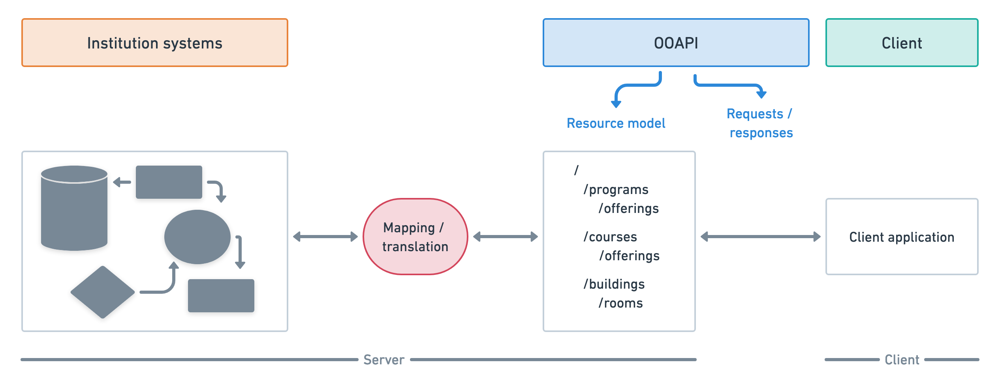

# Introduction

## About REST

The OEAPI specification is based on the REST architectural style for designing
APIs. REST is centred around the concept of a resource. A resource is the key
abstraction of information, where every piece of information is identified by a
globally unique URI (Uniform Resource Identifier).

Resources describe things. These may range from physical objects, such as a
building or a person, to more abstract concepts, such as a permit or an event.
Because resources describe things rather than actions, resources are identified
using nouns instead of verbs, from the perspective of the consumer of the API.

A resource describing a single thing is called a singular resource. Resources
can also be grouped into collections, which are resources in their own right
and can typically be paged, sorted and filtered. Most often, all members of a
collection have the same type, although this is not required.

A resource describing multiple things is called a collection resource.
Collection resources typically contain references to the underlying singular
resources.

Since OEAPI describes institutional information as resources, each institution
implementing OEAPI must define its own mapping between the OEAPI resources and
its internal data model.

## The specification

The OEAPI specification is formally defined using the
[OpenAPI Specification](https://www.openapis.org/), an industry standard for
describing REST APIs.

The current OEAPI specification is available here:

1. [OEAPI v6](https://oeapi.eu/specification/v6.0/)
   (current version, fully supported)

Previous OEAPI versions are available here:

1. [OEAPI v5](https://open-education-api.github.io/specification/v5/docs.html)
   (limited support)
2. [OEAPI v4](https://open-education-api.github.io/specification/v4/docs.html)
   (limited support)
3. [OEAPI v3](https://open-education-api.github.io/specification/v3/docs.html)
   (unsupported)
4. [OEAPI v2](https://open-education-api.github.io/specification/v2/docs.html)
   (unsupported)
5. [OEAPI v1](https://open-education-api.github.io/specification/v1/docs.html)
   (unsupported)
