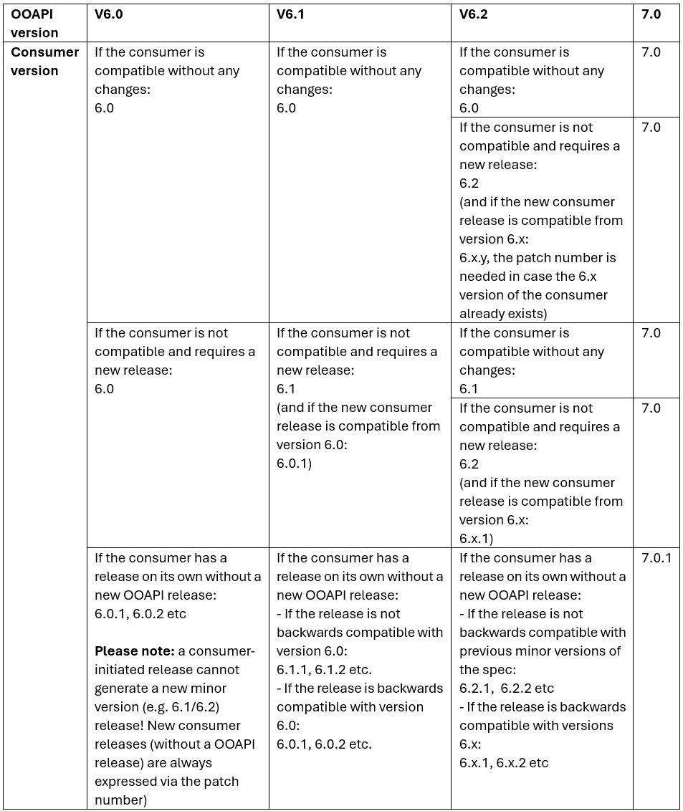

# Consumers and profiles

Since version 5.0, OEAPI has two mechanisms to support specific consumers.
Sometimes specific consumers of an OEAPI endpoint should be able to request
items intended specifically for them, or they require attributes that are not
specified in the base specification. In other cases, existing fields are made
mandatory for a project to achieve its goals.

Currently, OEAPI is used in several ways. Within institutions, it can be used
as an implementation to provide internal information to students, or as a
canonical model to enable the exchange of information between internal
systems within an institution. OEAPI is also used as a specification to enable
communication within the broader education sector. Examples include RIO and
eduXchange, and other developments are also underway. Since OEAPI is a broad
specification, this documentation also provides information about which
requests and responses should be implemented to ensure that specific
consumers (applications) function correctly.

There is a key difference between a consumer and a profile. Consumers are
developed as add-on attributes specifically for one object and one use case.
If an attribute has more than one use case the specific attribute could be added
to the general specification.

## Consumers — data extension within responses

A consumer is an entity (an application, platform, or system) that consumes the OEAPI.
The specification lets any consumer attach extra attributes to standard OEAPI objects, beyond what the base specification defines.
In practice: you pass a `?consumer={name}` query parameter in the request, and the response includes a nested consumer-specific object with additional fields.

For example:
The RIO consumer adds fields like educationOffererCode and jointPartnerCodes for programmes.
The eduXchange consumer adds fields like themes for courses and programmes, and current enrolment details for persons.

Consumers operate inside the API response — they enrich data for a specific receiving system.

## Profiles — conformance rules above the API

A profile is a formal document that defines a subset of OEAPI tailored for a specific use case or ecosystem. It specifies:

* Which endpoints are required to be implemented
* Which fields must be populated
* What validation rules apply

Profiles live outside the API itself — they operate at the specification level and are used for conformance checking and validation. Tools like the eduhub-validator use profiles to test whether an OEAPI endpoint meets the requirements for a particular context (e.g., the RIO profile or the eduXchange profile).

Profiles CAN use a consumer to add additional attributes to an OEAPI object but do not have to.

## Comparison between a profile and a consumer

|                | Consumer                                   | Profile|
|:-----------    | :------------                              | :---------- |
| What it is     | An extension mechanism in API responses    | A conformance definition for a use case         |
| Where it lives | Inside the response payload                | External specification/validation document      |
| Purpose        | Add extra fields for a specific system     | Define which parts of OEAPI must be implemented |
| Used by        | Receiving systems requesting tailored data | Standards bodies, validators, platform operators |

**The `consumer` extends what data is returned**, while **a `profile` defines what endpoints and fields must be present.** They are complementary — a profile like "eduXchange" may require that implementations also support the eduXchange consumer object. [OKE](https://netwerkexamineringdigitalisering.github.io/NED-OOAPI/) is a very specific example where the OEAPIv5 has been redefined to fit the use case for test management.

## Filtering responses for a specific consumer

The `consumer` query parameter mechanism allows clients to request items
intended for a specific consumer, e.g. `GET /courses?consumer=rio`.
When this query parameter is specified, the implementation should only
return items required for that specific consumer.

Besides using this query parameter for filtering, the consumer parameter
also serves to extend the base specifcation with extra attributes.

## Extending the specification with extra attributes for a specific consumer

The consumer query parameter mechanism also allows (a group of) users
implementing and using OEAPI to agree on a set of extra attributes that is
necessary to fulfil a specific use case. Such a mechanism also removes the
necessity of providing for each individual use case in the general OEAPI
specification.

Each entity described in OEAPI has a `consumer` attribute, which
implementers can use to add consumer-specific attributes:

```json
{
    "...": "...",
    "consumer": {
        "consumerKey": "<the consumer key>",
        "additional": "custom",
        "attributes": "here"
    }
}
```

The value of the `consumer` attribute is an object. Each consumer object
must at minimum contain the attribute `consumerKey`, which specifies the
consumer for which the extra attributes are defined.

## Consumer registry

The following table lists which consumer keys are in use by which consumers.
This list only shows the official and registered consumers of OEAPI that are
part of the specification and are maintained by OEAPI. There is no need to
register a consumer in order to use it. Implementations that wish to use this
mechanism without registering a key should prefix their consumerkey
with `x-`. The registered consumers are:

| Key           | Description                                                                                                                                         |
|---------------|-----------------------------------------------------------------------------------------------------------------------------------------------------|
| rio           | RIO is a central registry, maintained by the Dutch Government, that lists all educational institutions and the education they offer.               |
| eduxchange    | eduXchange is a website that allows students to enrol easily in education offered by other institutions.                                           |
| nl-test-admin | NL-test-admin is a specification of messages that are interchanged between exam and testing tools, supporting a standardised assessment process.   |

Registered consumers are shown here and are included in the OEAPI
specification (once and only once the specification is supplied by the
specific consumer). These consumers serve a specific use case and are
implemented by multiple solutions and organisations. In order to register a
new consumer and include it in the specification, a request can be made for a
'consumer adoption' via GitHub (new issue → change request). This applies if
a new consumer needs to be maintained through OEAPI governance. As a
requester, you are responsible for the maintenance of the consumer.

## Consumer versioning

Consumers that are part of the standard are kept in sync with the versioning
scheme of OEAPI. This is required to communicate with which OEAPI versions a
consumer is compatible and can be used. The basic rule is that the major
version number of the OEAPI standard must always be adopted by the consumer
specification:

1. A new major version of OEAPI is released. All consumers must be reviewed
   and, if required, adjusted. This always results in a new consumer version
   (with or without changes) following the major version number of the OEAPI
   standard.

In addition to this basic rule regarding a major OEAPI release, three other
situations can occur regarding OEAPI minor releases (1a and 1b) and new
consumer releases (2):

1. A new OEAPI minor version is released. Consumers can be:
   a. Compatible with the new release and require no change.  
      The consumer version will not change to indicate backwards (and
      forwards) compatibility.
   b. Not compatible with the new OEAPI release. Any impact on the consumer
      must be reviewed and resolved. A new consumer release will take place.  
      The consumer version number of this new release will change and will
      use the lowest (or current) minor version of the OEAPI specification to
      which it is backwards compatible. This could be the current minor
      version, but also one or multiple earlier minor releases. If this
      conflicts with an earlier consumer version number, a patch number is
      introduced or increased.

2. A new consumer version is released without a new OEAPI release.  
   The consumer version number will use the patch version number,
   introducing or increasing the patch version number following the lowest
   minor release of OEAPI with which this release is compatible.

An example of the versioning of consumers based on these rules is shown in
the following table:



## Profiles

In addition to the `consumer` query parameter and the `consumer` object, it
may be necessary for a specific application or use case to specify which
requests must be implemented for it to function. Applications may also
require attributes that are not required in the base specification. To
specify such requirements, we recognise "profiles". Since there is currently
no specific format defined to specify such a profile, profiles are described
using text and lists.
