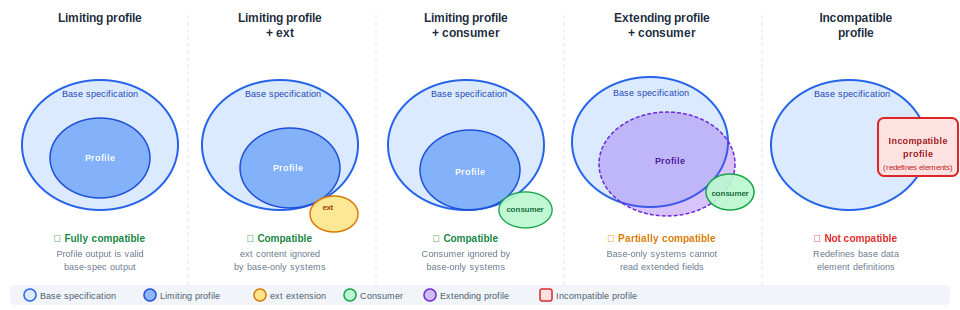

<!-- markdownlint-disable MD036 -->
# OEAPI Profiling Guidelines

**Version:** 0.1 (Draft)  
**Date:** June 2026  
**Status:** Draft for review

---

## Table of Contents

1. [Introduction](#1-introduction)  
   1.1 [Purpose and scope](#11-purpose-and-scope)  
   1.2 [Definitions](#12-definitions)  
   1.3 [References](#13-references)

2. [OEAPI design principles](#2-oeapi-design-principles)

3. [When and why to create a profile](#3-when-and-why-to-create-a-profile)  
   3.1 [What is an OEAPI profile?](#31-what-is-an-oeapi-profile)  
   3.2 [What is an OEAPI consumer?](#32-what-is-an-oeapi-consumer)  
   3.3 [Deciding whether to create a profile](#33-deciding-whether-to-create-a-profile)

4. [Governance of a profile](#4-governance-of-a-profile)  
   4.1 [Establishing a community](#41-establishing-a-community)  
   4.2 [Governance requirements](#42-governance-requirements)  
   4.3 [Versioning and lifecycle](#43-versioning-and-lifecycle)

5. [Profile development process](#5-profile-development-process)  
   5.1 [Requirements gathering](#51-requirements-gathering)  
   5.2 [Analysis and synthesis](#52-analysis-and-synthesis)  
   5.3 [Development](#53-development)  
   5.4 [Publication](#54-publication)  
   5.5 [Maintenance](#55-maintenance)

6. [Technical profiling operations](#6-technical-profiling-operations)  
   6.1 [Profile types and interoperability](#61-profile-types-and-interoperability)  
   6.2 [Categories of modification](#62-categories-of-modification)  
   6.3 [Restrictive modifications](#63-restrictive-modifications)  
   6.4 [Extensive modifications](#64-extensive-modifications)  
   6.5 [Incompatible modifications — what not to do](#65-incompatible-modifications--what-not-to-do)

7. [Extending the specification](#7-extending-the-specification)  
   7.1 [Using consumers](#71-using-consumers)  
   7.2 [Using the ext attribute](#72-using-the-ext-attribute)  
   7.3 [Adding new objects or endpoints](#73-adding-new-objects-and-endpoints)

8. [Documenting a profile](#8-documenting-a-profile)  
   8.1 [Required documentation elements](#81-required-documentation-elements)  
   8.2 [Documenting data model changes](#82-documenting-data-model-changes)  
   8.3 [Documenting flows and interactions](#83-documenting-flows-and-interactions)  
   8.4 [Publishing a machine-readable specification](#84-publishing-a-machine-readable-specification)

9. [Conformance and testing](#9-conformance-and-testing)

10. [Cross-profile compatibility and portability](#10-cross-profile-compatibility-and-portability)  
    10.1 [Best practices](#101-best-practices)  
    10.2 [Profile and consumer registry](#102-profile-and-consumer-registry)

11. [Examples of existing profiles](#11-examples-of-existing-profiles)

---

## 1. Introduction

### 1.1 Purpose and scope

The Open Education API (OEAPI) is a broadly applicable specification designed to support interoperability across educational institutions and ecosystems. Because it serves a wide range of use cases, not every community needs every part of it — and some communities need capabilities the base specification does not yet provide.

This document provides guidelines for creating an **OEAPI profile**: a precisely defined adaptation of the OEAPI specification for a specific community, use case, or deployment context. It describes:

- the decision process for whether a profile is appropriate,
- how a profile's governance should be organised,
- the technical operations available to restrict, extend, or adapt the specification,
- how to document and publish the result,
- and how profiles relate to the concepts of **consumers** and the **`ext` attribute** provided by the base specification.

These guidelines draw on the practical experience of existing OEAPI profiles: the OKE MBO exam administration profile (NED-OOAPI) and the eduxchange cross-institutional enrolment profile as well as the profiling that was done for RIO.

This document is intended for both the technical implementers who build and maintain profiles and for the governance bodies and working groups that own them.

### 1.2 Definitions

**Base specification** — The OEAPI specification (currently at [version 6.0](https://oeapi.eu/v6.0/)) that a profile is derived from.

**Profile** — A precisely defined adaptation of the base specification intended to meet the needs of a specific community. A profile may restrict the base specification, extend it using permitted mechanisms, or both. A profile must clearly state which version of the base specification it derives from.

**Consumer** — A named, community-specific grouping of additional attributes or fields, supported by the OEAPI `consumers` mechanism. A consumer allows extra data to travel alongside base-compliant messages without breaking base-specification validity. A consumer can be part of a profile, but can also exist independently.

**`ext` attribute** — A generic extension point in OEAPI objects that allows implementers to attach arbitrary additional data. Where a community needs recurring structured extensions, these should be formalised into a named consumer rather than relying on `ext`.

**Restrictive profile** — A profile that only permits a subset of what the base specification allows. Messages conforming to a restrictive profile also conform to the base specification. This is the preferred approach for write behaviour.

**Extensive profile** — A profile that permits or requires data beyond what the base specification defines. Messages conforming to an extensive profile may not validate against the base specification alone.

**Incompatible profile** — A profile that redefines or contradicts the base specification in ways that break interoperability with it completely. This must be avoided.

**Read profile / write profile** — A system may accept (read) a wider range of data than it produces (writes). A write profile should always be restrictive; a read profile may be extensive in order to tolerate base-compliant messages from non-profiled systems.

**Community** — The group of organisations and stakeholders that the profile is designed to serve, and that collectively own its governance.

### 1.3 References

| Reference | Description |
|---|---|
| [OEAPI v6](https://oeapi.eu/v6.0/) | Open Education API v6.0 |
| [NED-OOAPI](https://netwerkexamineringdigitalisering.github.io/NED-OOAPI/) | OKE MBO exam administration profile |
| [eduxchange](https://openonderwijsapi.nl/#/technical/consumers-and-profiles/eduxchange) | eduxchange cross-institutional enrolment profile |
| [eduxchange-tech](https://tech-docs.eduxchange.eu/) | eduxchange technical documentation |
| [OEAPI-DP](../design-principles.md) | OEAPI Design Principles (companion document) |

---

## 2. OEAPI design principles

Before creating a profile, it is essential to understand the design principles on which the OEAPI base specification is built. Profiles that respect these principles are more likely to be interoperable, maintainable, and accepted by the broader community.

The principles are documented in full in the companion document:

> **[OEAPI Design Principles](../design-principles.md)**

That document covers: architectural principles, the information model, identifier design, extensibility mechanisms, versioning, querying and field selection, enumerations, security and data minimisation, and language policy. Each section ends with a *Profile implication* note connecting the principle to concrete profiling decisions.

Key points to carry into profiling work:

- The OEAPI is a **specification for implementation**, not a central API. Each institution runs its own implementation.
- The **information model** is structured around four base objects (programme, course, learning component, test component), offerings, and associations. Profiles must work within this structure.
- **Extensions must use sanctioned mechanisms** (`ext` or named consumers). Adding custom endpoints or resources is not permitted.
- **Versioning is header-based** and explicit. Profiles must state which base spec version they require.
- **Enumerations** use the `x-` prefix for any custom values.
- **British English** is used throughout documentation and enumeration values.

---

## 3. When and why to create a profile

### 3.1 What is an OEAPI profile?

The OEAPI is a broad specification. A profile narrows or extends it for a specific purpose. Specifically, a profile may:

- **require** fields that the base specification marks as optional,
- **forbid** fields or endpoints that are irrelevant to the community,
- **restrict** allowed values (e.g., by specifying a closed vocabulary for a field that is open in the base),
- **add** extra fields or objects using the consumer mechanism or `ext` attribute,
- **define interaction flows** (sequences of API calls) that are required for a particular use case,
- **specify security and authorisation** requirements specific to the community.

A profile is not a fork of OEAPI. It is a layered specialisation that retains traceability to the base specification. Implementers can always understand a profile by reading it alongside the base specification.

### 3.2 What is an OEAPI consumer?

A **consumer** is a named, versioned set of additional fields that can be included in OEAPI objects alongside the base fields. The OEAPI base specification provides a `consumers` array in many objects precisely for this purpose.

A consumer is lighter-weight than a full profile. It is the right choice when:

- a community needs a small, bounded set of extra fields,
- the rest of the base specification is used without restriction,
- the extra fields travel alongside otherwise base-compliant messages.

A consumer can be independently documented and registered, and can be referenced from within a profile. For example, the eduxchange profile references a consumer that adds cross-institutional enrolment fields to the `association` object.

The key difference between a consumer and a profile:

| | Consumer | Profile |
|---|---|---|
| Adds extra fields | ✓ | ✓ (via consumer or ext) |
| Restricts required/optional | — | ✓ |
| Restricts allowed values | — | ✓ |
| Defines interaction flows | — | ✓ |
| Specifies security requirements | — | ✓ |
| Requires its own governance | — | ✓ |
| Traceability to base spec version | ✓ | ✓ |

### 3.3 Deciding whether to create a profile

Creating and maintaining a profile is a significant commitment. Before starting, the community should answer the following questions:

**Is the base specification insufficient as-is?**  
If the base specification meets all needs without adaptation, no profile is needed. Start with the base specification and document which endpoints and objects are used.

**Can a consumer alone solve the problem?**  
If the only need is to carry a few extra fields alongside otherwise standard messages, define a consumer rather than a full profile.

**Is there a stable community to own the profile?**  
A profile requires ongoing governance, versioning, and maintenance. If no stable group of organisations can commit to this, a profile is premature.

**Does an existing profile come close enough?**  
Before creating a new profile, check whether an existing one (such as NED-OOAPI or the eduxchange profile) can be reused or extended. Fragmentation of profiles reduces ecosystem interoperability.

If all the above have been considered and a profile is still warranted, proceed to the development process described in section 4.

---

## 4. Governance of a profile

A profile without governance is a snapshot, not a standard. This section defines the minimum governance requirements every profile must address.

### 4.1 Establishing a community

A profile is owned by a **community** — a defined group of organisations with a shared need. Before a profile can be formally published, the community must:

- be formally constituted, with a list of participating organisations,
- have a named **profile owner** (organisation or working group) responsible for the specification,
- have a process for accepting new participants,
- have a process for handling contributions and change proposals.

The OKE profile (NED-OOAPI) provides a good example: it was developed by a coalition of schools, exam providers, system vendors, and coordinating bodies (MBO Digitaal, NED, Surf, Kennisnet), with an explicit list of contributors and their organisations. The profile it self is also registered as a separate entity at [edustandaard](https://www.edustandaard.nl/standaard_afspraken/onderwijs-koppelingen-examinering-mbo/oke-mbo-1-0/)

### 4.2 Governance requirements

Every published profile must document the following governance aspects:

**Ownership and authority**  
Which organisation or body is the authoritative owner of the profile? Who has the final say on changes? The profile document must name this body explicitly.

**Decision-making process**  
How are changes to the profile decided? Examples include: consensus of a working group, vote among participating organisations, or decision by a named steering committee.

**Change proposal process**  
How can participants and implementers propose changes? A public issue tracker (e.g., GitHub Issues) is strongly recommended, as used by both NED-OOAPI and the eduxchange profile.

**IPR policy**  
What intellectual property rules apply? The profile should state under which license it is published (e.g., Creative Commons, Apache 2.0) and what rights implementers have.

**Conformance policy**  
How does a system demonstrate conformance with the profile? Who, if anyone, can certify conformance?

**Relationship to the base specification**  
The profile must state which version(s) of the OEAPI it is based on, and define a policy for how the profile will respond when the base specification releases a new version.

### 4.3 Versioning and lifecycle

Profiles must have an information point that provides additional information on the base specification from which the profile is derived. Profiles MUST have a versioning scheme so it is clear for implementers and users of a profile what the basis is on which the communication takes place. The following conventions are recommended:

- Use semantic versioning (MAJOR.MINOR.PATCH).
- Increment MAJOR when changes are incompatible with previous versions of the profile.
- Increment MINOR when new capabilities are added in a backwards-compatible way.
- Increment PATCH for editorial corrections that do not change meaning.
- Each profile version must state which version of the OEAPI base specification it requires.

Every published profile version should have a stable, permanent URI so that implementations can reference a specific version precisely. For example:

```text
https://profiles.oeapi.example/myprofile/v1.2/
```

The profile document should also state the **lifecycle status** of each version: Draft, Release Candidate, Final, Deprecated, or Withdrawn.

---

## 5. Profile development process

The process of developing an OEAPI profile follows these phases, which may be revisited iteratively:

```text
Community → Requirements → Analysis → Decision → Development → Publication → Maintenance
```

### 5.1 Requirements gathering

The community begins by documenting its requirements, including:

- the use cases the profile must support (expressed as flows or scenarios),
- the systems and parties involved,
- existing implementations and what they currently do,
- constraints (legal, organisational, technical) that apply.

At this stage, the community should also survey the base specification and any existing profiles to identify what already covers the requirements and where gaps exist. This process COULD be facilitated by using the [AMIGO](https://www.edustandaard.nl/amigo/versies/) method.

**Output:** a requirements document, including a list of gaps in the base specification.

### 5.2 Analysis and synthesis

Working from the requirements, the community:

- models the information flows (which systems exchange what data, in which order),
- identifies which OEAPI objects and endpoints are relevant,
- identifies which fields need to be mandatory, restricted, or added,
- decides whether to address any gaps via consumers, the `ext` attribute, or new objects,
- considers the interoperability impact of each proposed modification (see section 5).

At this stage, it is useful to produce an **information model diagram** showing the objects, their relationships, and the flows between systems. The NED-OOAPI profile provides a good example of this style of documentation.

**Output:** an information model, a list of proposed modifications with their interoperability impact, and a preliminary specification structure.

### 5.3 Development

The community produces the profile specification, which includes:

- a human-readable document describing the profile (see section 7),
- a machine-readable OpenAPI YAML file that represents the profiled subset of the base specification, including any extensions (see section 7.4),
- documentation of all interaction flows,
- conformance requirements.

The specification should be managed in version control (e.g., GitHub) from the start, to support contributions, review, and version history.

**Output:** a versioned profile specification in a public repository, with an associated OpenAPI YAML file.

### 5.4 Publication

Before a profile can be referenced by implementers, it must be formally published. Publication includes:

- assigning a stable version number and URI,
- making the specification publicly accessible,
- registering the profile and its consumer(s) in the OEAPI consumer and profile registry (if applicable),
- notifying the OEAPI community.

A profile should not be described as "final" until it has been reviewed by at least one party other than its author, and until at least one implementation exists.

### 5.5 Maintenance

After publication, the community must maintain the profile. Maintenance includes:

- responding to change proposals and bug reports,
- tracking new versions of the base specification and deciding how to align,
- publishing updated versions as needed,
- deprecating older versions with clear guidance for migration.

---

## 6. Technical profiling operations

### 6.1 Profile types and interoperability

Not all profiles affect interoperability in the same way. The diagram below identifies five distinct profile types, ranging from fully compatible to incompatible with the base specification. Understanding which type a profile is — and being explicit about it in the profile documentation — is essential for implementers deciding whether they can support multiple profiles in a single system.



**Limiting profile** — The profile is a strict subset of the base specification. Every message a limiting profile produces is valid base-specification output. Systems that implement only the base spec can read it without modification. This is the preferred and safest profile type.

**Limiting profile with `ext`** — The profile restricts the base specification and adds unstructured extra data via the `ext` field. Base-only systems can safely ignore `ext` content and still process the message correctly. The extension is invisible to systems that do not know about it.

**Limiting profile with consumer** — The profile restricts the base specification and adds structured extra data via a named consumer object. Like `ext`, the consumer content is ignored by base-only systems. The advantage over `ext` is that the consumer is named, versioned, and discoverable, making the extension reusable across implementations.

**Extending profile with consumer** — The profile requires or produces data that goes beyond what the base specification defines. The overlapping portion is interoperable with base-only systems, but the extended fields are not. Systems that need the full profile must implement the consumer explicitly. This type requires careful documentation of which parts are base-compatible and which are not.

**Incompatible profile** — The profile redefines or contradicts data element definitions from the base specification. There is no meaningful interoperability with the base specification or with other profiles that do not share the same redefinitions. This must be avoided. If a community requirement appears to demand this, the correct response is to raise a change request with the OEAPI Technical Working Group.

> The key distinction between *extensive* and *incompatible* is not the presence of extra data, but whether data element definitions agree. A profile that adds new fields via sanctioned mechanisms (consumer, `ext`) while preserving base definitions is extensive but not incompatible. A profile that changes what an existing field means is incompatible, regardless of how much other content it shares.

### 6.2 Categories of modification

All modifications to the base specification fall into one of three categories. The category determines the interoperability consequences.

**Restrictive modifications** constrain what the profile allows relative to the base specification. A message that is valid according to a restrictive profile is also valid according to the base specification. Systems that implement only the base specification can read messages produced by a restrictive profile. *Restrictive modifications are strongly preferred for write behaviour.*

**Extensive modifications** permit or require things beyond the base specification. A message valid according to an extensive profile may not be valid according to the base specification. Systems that implement only the base specification may not be able to process such messages. Extensive modifications are acceptable for read behaviour (tolerating extra fields), but should be used cautiously in write behaviour.

**Incompatible modifications** contradict or redefine the base specification in ways that destroy interoperability entirely. These must never be used. Note that combining restrictive and extensive modifications in the same write profile also results in an incompatible profile.

### 6.3 Restrictive modifications

The following restrictive operations are permitted and recommended where appropriate.

**Making an optional field mandatory**  
The base specification marks many fields as optional. A profile may require specific fields to always be present. This improves consistency within the community at the cost of making the profile stricter than the base.

*Example: In the eduxchange profile, `activeEnrollment` in the `person` object is required, whereas it is optional in the base specification.*

**Restricting an enumeration**  
Where the base specification allows a broad set of values for a field, the profile may restrict it to a smaller set relevant to the community.

*Example: A profile might restrict the `modeOfDelivery` field to only `online`, `coil` and `hybrid`, excluding other types not used within the community for online learning.*

**Restricting a text field length**  
A profile may impose a maximum or minimum length on string fields, for example to align with constraints of existing systems.

**Excluding optional fields or endpoints**  
A profile may state that certain optional fields must not be used, or that certain endpoints are out of scope. This reduces the surface area implementers need to support.

**Mandating fields conditionally**  
A field may be required when another field has a particular value. This is a non-schema constraint and must be expressed in prose and/or using a validation tool such as Schematron or OpenAPI extensions.

*Example: In the NED-OOAPI profile, specific result fields are required only when `resultExpected` is true.*

**Restricting vocabularies**  
Where the base specification references an open or extensible vocabulary, the profile may specify a closed, community-specific vocabulary.

**Clarifying the meaning of a field**  
The profile may provide additional narrative explaining how a field is to be interpreted within the community context. This does not change the structure but reduces ambiguity.

*Note: It is important that the meaning does NOT change based on the clarification otherwise the profile WILL become incompatible.*

### 6.4 Extensive modifications

Extensive modifications carry interoperability risks and should only be used when restrictive alternatives do not meet the community's needs.

**Adding extra fields via the consumer mechanism**  
This is the *preferred* extensive modification. The OEAPI base specification provides a `consumers` array in many objects. A named, versioned consumer adds fields to a specific object in a structured, discoverable way that does not break base-specification validation.

**Adding extra fields via the `ext` attribute**  
Many OEAPI objects include an `ext` field for unstructured extensions. This is appropriate for ad-hoc additions, but if the same fields are needed consistently across an ecosystem, they should be formalised into a named consumer.

**Adding new objects or endpoints**  
A profile may define additional objects or endpoints not present in the base specification. These must be clearly distinguished from base specification elements and documented separately. See section 6.3.

**Widening a vocabulary**  
Adding values to a vocabulary that is defined inline in the base specification is an extensive modification. This risks producing messages that base-specification-only systems cannot process.

### 6.5 Incompatible modifications — what not to do

The following operations break interoperability and must be avoided:

- **Renaming existing fields or objects** — even if the semantics are the same. Downstream systems relying on the base field names will fail.
- **Changing the type of an existing field** — for example, changing a string field to an integer.
- **Removing mandatory fields** — making a required field optional, or removing it entirely.
- **Redefining the meaning of a field** — giving a field a semantically different meaning from the base specification.
- **Combining restrictive and extensive modifications in the same write profile** — this results in messages that neither fully conform to the base specification nor fully conform to the profile.

If a community requirement genuinely cannot be met without an incompatible modification, this is a signal that the requirement should be raised with the OEAPI specification committee as a change request to the base specification, rather than addressed in a profile.

---

## 7. Extending the specification

### 7.1 Using consumers

A **consumer** is the recommended mechanism for adding structured, community-specific fields to OEAPI objects. To define a consumer:

1. **Choose a name** for the consumer that is unique and clearly identifies the community or use case (e.g., `eduxchange`, `oke-mbo-exams`).
2. **Define the fields** the consumer adds, including their types, cardinality, and semantics. Document each field in the same level of detail as the base specification.
3. **Version the consumer** independently, using the same versioning conventions as the profile.
4. **Register the consumer** in the OEAPI consumer registry so that other communities can discover and potentially reuse it.
5. **Reference the consumer from the profile** document, specifying which version of the consumer is required.

The consumer's fields appear in the `consumers` array of the relevant OEAPI object. A system that does not implement the consumer can safely ignore the consumer's content; a system that does implement it can read and write the extra fields.

Example structure in a `person` response (eduxchange-style):

```json
{
  "personId": "123e4567-e89b-12d3-a456-426614174000",
  "givenName": "Jan",
  "surname": "Jansen",
  "consumers": [
    {
      "consumerKey": "eduxchange",
      "activeEnrollment": true,
      "otherCodes": [
        { "codeType": "schacHome", "code": "university.nl" }
      ]
    }
  ]
}
```

### 7.2 Using the ext attribute

The `ext` attribute is available in OEAPI objects for truly ad-hoc extensions. It accepts arbitrary JSON. It should be used:

- for implementation-specific fields that are not shared across multiple systems,
- as a temporary solution while a formal consumer is being defined.

The `ext` attribute should **not** be used to carry fields that multiple parties in the ecosystem must agree on. When the same `ext` content is expected across many implementations, it should be promoted to a named consumer.

A profile document may define and document the expected content of `ext` fields for its community — effectively treating `ext` as a named consumer without going through the formal consumer registration process. This is acceptable for profiles in early development but should be formalised over time.

### 7.3 Adding new objects and endpoints

In some cases, a community's requirements cannot be met by extending existing objects alone. New objects or endpoints may be needed. When adding these:

- **Prefix or namespace the new paths** to clearly distinguish them from base specification paths (e.g., `/oke/exam-sessions` rather than `/exam-sessions`).
- **Document the new objects** in the same format and level of detail as base specification objects.
- **Avoid conflicting names** with base specification objects. If a new object is closely related to a base object, document the relationship explicitly.
- **Consider raising a change request** to the OEAPI specification committee, especially if the new objects could be useful to other communities.

New objects and endpoints are by definition extensive modifications and should be introduced only when the existing base specification cannot meet the need through any combination of consumers and `ext`.

---

## 8. Documenting a profile

Good documentation is what makes a profile usable. This section defines the minimum documentation structure a profile must have.

### 8.1 Required documentation elements

Every profile must include:

**Identity**

- Name of the profile
- Version number
- Date of publication
- Lifecycle status (Draft / Release Candidate / Final / Deprecated)
- Stable URI for this version
- Which version(s) of the OEAPI base specification this profile is derived from

**Governance**

- Name and contact details of the profile owner
- List of participating organisations
- Decision-making and change proposal process
- IPR and license statement

**Scope**

- The use case(s) the profile addresses
- The community it is designed for
- Systems and roles involved

**Normative language**  
The profile should use normative language consistently. The keywords MUST, MUST NOT, SHOULD, SHOULD NOT, MAY are recommended (following RFC 2119).

**Change history**  
A table recording versions, dates, authors, and a summary of changes.

### 8.2 Documenting data model changes

For each OEAPI object that the profile modifies, document:

- which fields are **required** by this profile (even if optional in the base),
- which fields are **forbidden** or out of scope,
- any **vocabulary restrictions** applied to enumeration fields,
- any **conditional requirements** (field X is required when field Y has value Z),
- any **additional fields** added via consumers or `ext`,
- any **fields that should be ignored** when received (for tolerance / read profile behaviour).

The recommended format for this documentation is a **per-object table** that lists all relevant fields, their base-specification cardinality, and the profile cardinality, with a notes column. The NED-OOAPI profile's section 4 (Gegevensmodel) is a good example of this approach.

Example format:

| Field | Base spec | This profile | Notes |
|---|---|---|---|
| `personId` | required | required | |
| `givenName` | required | required | |
| `activeEnrollment` | optional | required | Must be `true` or `false`; indicates whether student is currently active |
| `gender` | optional | not used | Excluded from this profile |
| `consumers[eduxchange].schacHome` | — | required | Added via eduxchange consumer |

### 8.3 Documenting flows and interactions

A profile typically defines not just what data looks like, but how it flows between systems. For each interaction flow, document:

- the systems involved and their roles (provider, consumer),
- the sequence of API calls (as a numbered list or sequence diagram),
- which endpoint is called, with HTTP method and path,
- the required request and response fields for each call,
- error handling and expected HTTP status codes,
- any preconditions or postconditions.

Sequence diagrams (e.g., as embedded SVG or using Mermaid syntax) are strongly recommended. Both the NED-OOAPI and eduxchange profiles provide good examples of flow documentation.

### 8.4 Publishing a machine-readable specification

In addition to the human-readable document, a profile should publish a **machine-readable OpenAPI YAML file** that formally describes the profiled API. This file:

- is derived from the OEAPI base specification YAML,
- removes endpoints and fields that are out of scope,
- makes optional fields required where the profile mandates them,
- adds consumer-defined fields and any new objects,
- is published at a stable URI alongside the human-readable document.

The NED-OOAPI profile publishes an adapted YAML at `https://netwerkexamineringdigitalisering.github.io/NED-OOAPI/specification/ooapiv5_MBO.yaml` — this is the recommended pattern.

It is good practice to host both the human-readable documentation and the machine-readable YAML in the same public repository (e.g., GitHub), using GitHub Pages or similar for rendering.

---

## 9. Conformance and testing

A profile is only useful if implementers can determine whether their systems conform to it. The profile must therefore define what conformance means.

**Conformance levels**  
If appropriate, define more than one conformance level (e.g., a minimal set vs. a full implementation). Each level must have a clear, testable definition.

**Mandatory vs. recommended**  
Distinguish clearly between what an implementation MUST do (mandatory for conformance) and what it SHOULD do (recommended but not required).

**Testability**  
Each conformance requirement should be testable — either automatically (via an OpenAPI validator against the profile YAML) or via a documented manual test procedure.

**Conformance testing approach**  
The profile should describe:

- which tool(s) can be used to validate API responses against the profile schema,
- any additional tests for conditional requirements, flow behaviour, or security,
- whether a formal certification process exists.

Where no automated tooling exists yet, document the testing procedure in enough detail that two independent testers would reach the same result.

**Interoperability testing**  
For profiles used in multi-party ecosystems, consider defining an interoperability test event in which multiple implementations test against each other. The NED-OOAPI pilot program is a good example of this approach.

---

## 10. Cross-profile compatibility and portability

As the OEAPI ecosystem grows, multiple profiles will coexist. Systems may need to interoperate across profile boundaries — for example, a system built to the eduxchange profile receiving data from a system built to a different profile, or a vendor choosing to support multiple profiles in a single product. The practices in this section increase the chance that such cross-profile interoperability is achievable without custom integration work.

### 10.1 Best practices

**Prefer restrictive over extensive modifications in write behaviour.** This is the single most impactful rule. If every profile's write output is a valid subset of the base specification, then any system implementing the base spec can at least read it — even without knowing the profile. The moment profiles start writing fields outside the base, profile-specific parsers are required everywhere.

**Never redefine the meaning of a base field.** Profiles are tempted to repurpose a field that is "close enough" to avoid adding a consumer. This creates silent semantic incompatibility — two systems can exchange valid-looking messages while meaning completely different things. If the base field does not fit, add a named consumer field instead.

**Keep consumer definitions narrow, well-named, and registered.** A tightly scoped, well-documented consumer can be reused across profiles. If two profiles independently define overlapping consumers with different names and slightly different semantics, fragmentation results that is very hard to undo. Before defining a new consumer, check the registry (see section 9.2) for existing ones.

**Document the read profile separately from the write profile.** Systems should be tolerant readers — accepting fields they do not understand, including base-spec fields outside the profile's scope and consumer fields from other profiles. Documenting read behaviour explicitly (e.g., "unknown fields in the `consumers` array MUST be ignored") prevents implementers from treating the profile's write constraints as rejection rules for incoming data.

**Lock profiles to specific base spec versions.** A profile that says "based on OEAPI v6" is ambiguous as soon as v6.1 appears. Pin to the exact version, define an upgrade policy, and bump the profile version when moving to a new base. This allows implementers to reason clearly about which combination of profile and base specification they are implementing.

**Align on shared vocabularies early.** Vocabulary differences are the most common cause of silent semantic incompatibility between profiles. Where two profiles both restrict the same base field to a vocabulary, they should use overlapping or identical terms where possible, or document explicit mappings between them.

**Design for secondary profiling.** A profile built to be profiled further — leaving room for community-specific restrictions on top — ages much better. Secondary profiling (adapting an existing profile for a more specific context) is a common real-world need that is rarely designed for upfront. Designing explicitly for it avoids later incompatibilities.

**Run cross-profile interoperability tests, not just conformance tests.** Conformance tests check whether a system satisfies one profile. Interoperability tests check whether two systems implementing different profiles can still exchange meaningful data through the base specification. Iterative pilots with real systems — as used in the NED-OOAPI development — are the practical form of this.

### 10.2 Profile and consumer registry

> **Note:** This section is a placeholder. A formal OEAPI profile and consumer registry does not yet exist. The content below describes the intended future state.

A central registry of OEAPI profiles and consumers is essential for preventing fragmentation and enabling reuse. The registry should be:

- **publicly accessible** — readable by anyone without registration,
- **community-maintained** — profiles and consumers are submitted by their owners and reviewed before inclusion,
- **versioned** — each registered entry links to a specific version of the profile or consumer, with a stable URI,
- **machine-readable** — the registry itself should be available in a structured format (e.g., JSON or YAML) so that tooling can consume it.

Each registry entry for a **profile** should include:

| Field | Description |
|---|---|
| Name | Short unique identifier (e.g., `oke-mbo-exams`) |
| Display name | Human-readable name |
| Version | Version number |
| Status | Draft / Release Candidate / Final / Deprecated |
| Base spec version | Which OEAPI version this profile derives from |
| Owner | Name and contact of the responsible organisation |
| Specification URI | Stable link to the human-readable specification |
| OpenAPI YAML URI | Stable link to the machine-readable YAML |
| Consumers used | List of consumer names referenced by this profile |

Each registry entry for a **consumer** should include:

| Field | Description |
|---|---|
| Name | Short unique identifier (e.g., `eduxchange`) |
| Version | Version number |
| Status | Draft / Release Candidate / Final / Deprecated |
| Base spec version | Which OEAPI version this consumer was created for |
| Owner | Name and contact of the responsible organisation |
| Applies to | Which OEAPI objects the consumer extends |
| Specification URI | Stable link to the consumer definition |
| Used by | List of profiles that reference this consumer |

**Proposed registry location:** `[to be determined — suggested: a GitHub repository under the OEAPI organisation, rendered via GitHub Pages]`

Until a formal registry exists, profiles and consumers should at minimum be:

- published in a public repository with a stable URL,
- announced to the OEAPI community mailing list or forum,
- linked from the OEAPI specification website.

---

## 11. Examples of existing profiles

The following profiles can be used as reference implementations of these guidelines.

### eduxchange profile

**Purpose:** Cross-institutional course enrolment between higher education institutions in university alliances.  
**Approach:** Defines a consumer (`eduxchange`) with additional fields on `person` and `association` objects. Specifies required endpoints and their mandatory fields. Defines the full enrolment interaction flow.  
**Repository:** [documentation repository](https://openonderwijsapi.nl/#/technical/consumers-and-profiles/eduxchange)
**Technical docs:** [technical documentation](https://tech-docs.eduxchange.eu/)
**What to learn from this profile:** How to define a consumer, how to document minimal required fields per endpoint, how to describe a multi-step interaction flow.

### OKE MBO exam administration profile (NED-OOAPI)

**Purpose:** Standardised exchange of exam planning, participant registration, session data, and results between student information systems, planning tools, and exam delivery systems in Dutch MBO (vocational education).  
**Approach:** Defines a profile of OOAPI v5 with a shortened YAML, per-object field tables, multiple interaction flows, and detailed per-flow documentation. The profile was developed iteratively through a series of pilots.  
**Repository:** [full profile repository](https://netwerkexamineringdigitalisering.github.io/NED-OOAPI/)
**Specification document:** `OKE MBO-toetsafname specs v1.0 (definitief)`, September 2024  
**What to learn from this profile:** How to structure a detailed profile document, how to document data model changes per object, how to define and document multiple interaction flows, how to manage a multi-stakeholder development process through pilots.

---

*This document is a living guideline. Feedback and contributions are welcome via [the project repository].*
