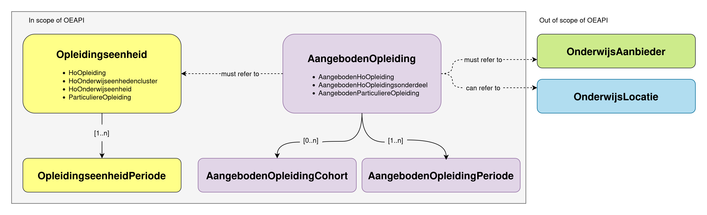
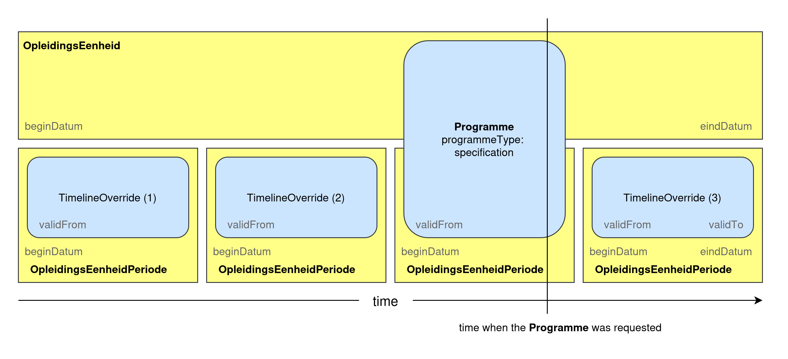
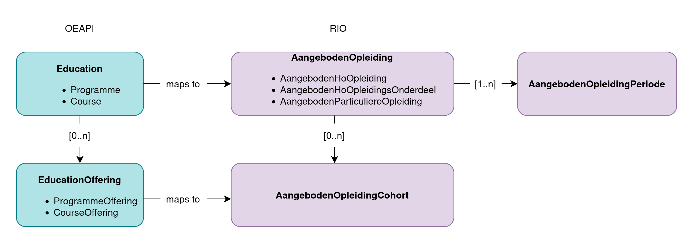

<!-- markdownlint-disable MD024 -->
<!-- markdownlint-disable MD032 -->
<!-- markdownlint-disable MD033 -->
<!-- markdownlint-disable MD051 -->
# RIO

RIO stands for [Register Instellingen en Opleidingen](https://www.rio-onderwijs.nl/). It is a Dutch national register provided by [DUO](https://www.duo.nl) in which educational institutions record three things: their educational offerings, how they are organised, and how to get in touch with them. DUO and other accrediting organisations record accreditations and licences in RIO.

To support Dutch educational institutions with filling and maintaining their information in RIO, [SURF](https://www.surf.nl) provides SURFeduhub. [SURFeduhub](https://www.surf.nl/surfeduhub) is a platform for sharing educational data (using the OEAPI specification) between Dutch educational institutions (providers) and various consumers. RIO is one of the consumers supported by SURFeduhub.

To make the RIO functionality of SURFeduhub work an OEAPI implementation needs to implement the specific extensions as described on this page. When correctly implemented, the OEAPI base and the RIO extension provide a 1-to-1 mapping from the OEAPI model to the RIO model.

An educational institution needs to implement the following calls to be compatible with RIO:
- `GET /programmes/{programmeId}?returnTimelineOverrides=true`
- `GET /programmes/{programmeId}/programme-offerings?pageSize=250&consumer=rio`
- `GET /courses/{courseId}?returnTimelineOverrides=true`
- `GET /courses/{courseId}/course-offerings?pageSize=250&consumer=rio`

!> All calls returning collections need to support at least the `consumer` query parameter and should only return entities meant for RIO when this parameter is set to `rio`, e.g. `?consumer=rio`.

!> All calls returning resources should have the "rio consumer object" in the `consumer` attribute. The `consumerKey` of this consumer should be set to `"rio"`.

Furthermore, the returned entities should implement the attributes as described on this page. Some of this attributes are part of the additional "RIO Consumer object". See the general information about [specific consumers](consumers) for more information.

## Mapping OEAPI to RIO

### RIO Model



This is a simplified version of the RIO model. It leaves out a lot of details and only describes the parts that are relevant for the mapping from OEAPI to RIO. The following entities are in scope:
- OpleidingsEenheid, and the following specializations:
  - HoOpleiding
  - HoOnderwijseenhedenCluster
  - HoOnderwijseenheid
  - ParticuliereOpleiding (Non-formele opleiding)
- OpleidingsEenheidPeriode, and the following specializations:
  - HoOpleidingPeriode
  - HoOnderwijseenhedenClusterPeriode
  - HoOnderwijseenheidPeriode
  - ParticuliereOpleidingPeriode (Non-formele opleidingperiode)
- AangebodenOpleiding, and the following specializations:
  - AangebodenHoOpleiding
  - AangebodenHoOpleidingsOnderdeel
  - AangebodenHoParticuliereOpleiding (Aangeboden non-formele opleidingperiode)
- AangebodenOpleidingPeriode, and the following specializations:
  - AangebodenHoOpleidingPeriode
  - AangebodenHoOpleidingsOnderdeelPeriode
  - AangebodenHoParticuliereOpleidingPeriode (Aangeboden non-formele opleidingonderdeelperiode)
- AangebodenOpleidingCohort, and the following specializations:
  - AangebodenHoOpleidingCohort
  - AangebodenHoOpleidingsonderdeelCohort
  - AangebodenParticuliereOpleidingCohort (Aangeboden Non-formele opleidingcohort)

!> Out of scope are OnderwijsAanbieder and Onderwijslocatie. However at least an OnderwijsAanbider entity must exist in RIO before an AangebodenOpleiding can be created. Institution are responsible themselves to create OnderwijsAanbieder and Onderwijslocatie entities beforehand using the RIO web interface.

## Perioden and `timelineOverrides`

To be able to fill RIO it is necessary to be able to communicate about historic or future information regarding entities. RIO differentiates between attributes of an entity that remain stable for the lifetime of the entity and attributes whose values may change over time. The attributes that may change over time are grouped together in entities called "Perioden". Entities such as an OpleidingsEenheid and an AangebodenOpleiding must have *at least one* Periode. OEAPI however, is primarily meant to describe entities *as they are now*. Since v5.0 OEAPI has a mechanism to also specify historic and future versions of entities.

For RIO [this mechanism](/technical/historical-and-future-data) can be leveraged as follows:
- An OEAPI implementation is expected to always return the current values of attributes.
  - The subset of these *current* attributes that RIO considers *changeable over time* will constitute one Periode.
  - With start (`beginDatum`) and end dates (`eindDatum`) as specified by the attributes `validFrom` and `validTo`.
- For each historic or future Periode that an implementation wishes to communicate, a`timelineOverride` object must be added to the array of `timelineOverrides`.
  - Each `timelineOverride` will be translated to another Periode.
  - With start and end dates as specified by the attributes `startDate` and `endDate` from the `timelineOverride`.
- The `beginDatum` and `eindDatum` for the main object in RIO will be automatically set by the mapping process.
  - `beginDatum` will be the earliest `validFrom` date from both the main OEAPI object and its `timelineOverrides`.
  - `eindDatum` will not always be set. If the latest mapped Periode has no `eindDatum`, no `eindDatum` will be set to the main RIO object. Otherwise the latest `eindDatum` will be set.



### Example

The above diagram shows an example of this mechanism when applied to a Programme of programmeType `specification`:
- On the horizontal axis we've depicted "valid time".
- A vertical line indicates when the OEAPI request `GET /programmes/{programmeId}?returnTimelineOverrides=true` was made.
- The Programme object (big blue object) will be mapped to two entities in RIO:
  - The OpleidingsEenheid
  - And one OpleidingsEenheidPeriode
- Its three `timelineOverrides` will be mapped to three Perioden.

*Note that this mechanism also works for other Programmes and Courses.*

### RIO contraints

RIO enforces the following constraints when dealing with Perioden:
- Perioden should be contiguous, that is, there should be *no gaps* in time.
- Perioden should not overlap in time.
- The `beginDatum` of the earliest Periode should be the same as the `beginDatum` of the main object.
- The `eindDatum` of the latest Periode should be the same as the `eindDatum` of the main object.
- The `beginDatum` of a Periode should be before its `eindDatum`.
- There should be at least one Periode, and all Periodes together should cover the entire lifespan of the main object.

*Note that an `eindDatum` for the latest Periode (and thus for the main object) is **not required***.

*Note that `eindDatum` will be determined automatically by RIO for Perioden that are not the latest Periode, based on the `beginDatum` from the Periode directly following it. However, since the OEAPI `timelineOverride` mechanism is meant to be more generic and also usable for other use cases, OEAPI allows specifying `validTo` dates explicitely.*

<style>
  .colored-table tr:nth-child(odd) > td:nth-child(1) { background: #eef7f9 }
  .colored-table tr:nth-child(even) > td:nth-child(1) { background: #daf0f6; }
  .colored-table.yellow tr:nth-child(odd) > td:nth-child(2) { background: #fffff0; }
  .colored-table.yellow tr:nth-child(even) > td:nth-child(2) { background: #fffbca; }
  .colored-table.purple tr:nth-child(odd) > td:nth-child(2) { background: #fff8ff; }
  .colored-table.purple tr:nth-child(even) > td:nth-child(2) { background: #f8e2f8; }
</style>

## Mapping Programmes of programmeType `specification` to RIO Opleidingseenheden


### Mapping variant relationships between OEAPI Programmes of programmeType `specification`

Programmes of programmeType specification can be related to another Programme of programmeType specification, which will be translated to RIO as relations between OpleidingsEenheden. Right now the SURFeduhub RIO mapping functionality only supports relations between a Programme of programmeType `specification` with `consumer › specificationType = programme` on the one side, and a Programme of programmeType `specification` with `consumer › specificationType = variant` on the other side. To link the two together, the Programme with `consumer › specificationType = variant` will have to contain an extra attribute in the consumer object `consumer › variantOf` which contains the `programmeId` of the related Programme. The Programme with `consumer › specificationType = specification` will have to contain an extra attribute in the consumer object `consumer › variantIds`, listing all programmeIds that are a variant of that programme.


<div class="colored-table yellow">

<!-- tabs:start -->

### **HoOpleiding**

| Programme                                  | HoOpleiding                          | Enumeration mapping                            | RIO field description                                                                                                                                                                                    | Remarks                                                                                                                                                                                                |
| ------------------------------------------ | ------------------------------------ | ---------------------------------------------- | -------------------------------------------------------------------------------------------------------------------------------------------------------------------------------------------------------- | ------------------------------------------------------------------------------------------------------------------------------------------------------------------------------------------------------ |
| programmeType [*]                          |                                      |                                                |                                                                                                                                                                                                          | Only programmes that have `programmeType=specification` will be mapped to RIO as an Opleidingseenheid                                                                                                  |
| consumer › specificationType[*]            |                                      |                                                |                                                                                                                                                                                                          | Determines whether this Programme maps to a HoOpleiding (programme/variant), HoOnderwijsEenhedenCluster (cluster), HoOnderwijsEenheid (course) or ParticuliereOpleiding (private)                      |
|                                            | opleidingseenheidcode [0..1]         |                                                | Een betekenisloze identifier voor een opleidingseenheid in de Registratie Instellingen en Opleidingen.                                                                                                   | RIO field constraints: [[1]](#rio-field-constraints) <br> Will be determined during transit.                                                                                                           |
| validFrom                                  | beginDatum [1]                       |                                                | De datum die het begin van de periode aangeeft (inclusief).                                                                                                                                              |                                                                                                                                                                                                        |
| validTo                                    | eindDatum [0..1]                     |                                                | De datum die het einde van de periode aangeeft (exclusief).                                                                                                                                              |                                                                                                                                                                                                        |
| programmeId [*]                            | eigenOpleidingsEenheidSleutel [0..1] |                                                | Een identificerend kenmerk dat door een particuliere organisatie is bepaald voor een particuliere opleiding ten behoeve van uitwisseling in de keten.                                                    |                                                                                                                                                                                                        |
| consumer › specificationType[*]            | soort [1]                            |                                                | Mogelijke verscheidenheden van een opleiding in het hoger onderwijs.                                                                                                                                     | RIO field constraints: [[2]](#rio-field-constraints) <br> If specificationType is `programme`, this will be mapped to `OPLEIDING`. If specificationType is `variant`, this will be mapped to `VARIANT` |
| formalDocument                             | waardedocumentsoort [1]              | [mapping](#formaldocument-waardedocumentsoort) | Aanduiding van het soort waardedocument dat kan worden of is behaald.                                                                                                                                    | RIO field constraints: [[2]](#rio-field-constraints)                                                                                                                                                   |
| level + consumer › sector                  | niveau [1]                           | [mapping](#sector-level-niveau)                | Een unieke code voor het opleidingsniveau ten behoeve van opleidingen en vakken van alle onderwijssectoren.                                                                                              | Waarde ONBEPAALD is voor niet formeel erkende opleidingseenheden.                                                                                                                                      |
| fieldsOfStudy                              | ISCED [0..1]                         |                                                | Het kwalificatieraamwerk waardoor opleidingen internationaal ingeschat kunnen worden op hun niveau.                                                                                                      | RIO filed constraints: [[3]](#rio-field-constraints) <br> Het beheer wordt uitgevoerd door UNECSO.                                                                                                     |
| *timelineOverrides*                        | *HoOpleidingPeriode* [1..n]          |                                                | De specifieke eigenschappen van een HO opleiding die in de tijd kunnen wijzigen                                                                                                                          | See also [Historical and future data](historical-and-future-data.md).                                                                                                                                  |
| validFrom or timelineOverrides › validFrom | » beginDatum [1]                     |                                                | De datum die het begin van de periode aangeeft (inclusief).                                                                                                                                              |                                                                                                                                                                                                        |
| name                                       | » naamLang [1]                       |                                                | Lange naam voor een opleidingseenheid zoals een opleiding, een opleidingsgroep, een opleidingsfase of een opleidingsonderdeel.  Er moet minstens één naam in een taal zijn opgegeven aan de OEAPI-zijde. | In het voortgezet onderwijs is dit de naam van de opleiding zoals die is opgenomen in de publicatie in de Staatscourant.                                                                               |
| abbreviation                               | » naamKort [0..1]                    |                                                | Korte naam voor een opleidingseenheid zoals een opleiding, een opleidingsgroep, een opleidingsfase of een opleidingsonderdeel.                                                                           | RIO field constraints: [[1]](#rio-field-constraints). Limit in RIO is 1 - 40 characters.                                                                                                               |
| name › en*** [*]                           | » internationaleNaam [0..1]          |                                                | De naam voor internationaal gebruik ter aanduiding van een opleidingseenheid zoals een opleiding, een opleidingsgroep, een opleidingsfase of een opleidingsonderdeel.                                    | RIO field constraints: [[1]](#rio-field-constraints)                                                                                                                                                   |
| description › nl-NL                        | » omschrijving [0..1]                |                                                | Nadere beschrijving                                                                                                                                                                                      | RIO only allows plain text. OEAPI allows plain text and Markdown. NOTE: if for some reason HTML tags are present, RIO will reject the data. RIO has a limit of 3000 character for this field.          |
| studyLoad › value                          | » studielast [0..1]                  |                                                | Een getal dat de inspanning weergeeft die de opleiding vergt.                                                                                                                                            | Wordt alleen gemapt als er niet meer dan 1 item in de studyLoad array aanwezig is en ```consumer › studyLoad``` niet gedefinieerd is.                                                                  |
| studyLoad › studyLoadUnit                  | » studielasteenheid [0..1]           | [mapping](#studyloadunit-studielasteenheid)    | De meeteenheid voor de studielast                                                                                                                                                                        | Wordt alleen gemapt als er niet meer dan 1 item in de studyLoad array aanwezig is en ```consumer › studyLoad``` niet gedefinieerd is.                                                                  |
| consumer › studyLoad › value               | » studielast [0..1]                  |                                                | Een getal dat de inspanning weergeeft die de opleiding vergt.                                                                                                                                            | Als deze waarde gedefinieerd is wordt de ```studyLoad``` array uit het base OEAPI object genegeerd.                                                                                                    |
| consumer › studyLoad › studyLoadUnit       | » studielasteenheid [0..1]           | [mapping](#studyloadunit-studielasteenheid)    | De meeteenheid voor de studielast                                                                                                                                                                        | Als deze waarde gedefinieerd is wordt de ```studyLoad``` array uit het base OEAPI object genegeerd.                                                                                                    |
| consumer › variantIds                      |                                      |                                                |                                                                                                                                                                                                          | Lijst met programmes die een variant zijn van deze programme                                                                                                                                           |

> OEAPI fields marked with `[*]` are required fields in the OEAPI specification.
> RIO fields marked with `[1]` or `[1..n]` are required by RIO.

### **HoOnderwijsEenhedenCluster**

| Programme                                  | HoOnderwijseenhedencluster                 | Enumeration mapping                            | RIO field description                                                                                                                                                                                   | Remarks                                                                                                                                                                                        |
| ------------------------------------------ | ------------------------------------------ | ---------------------------------------------- | ------------------------------------------------------------------------------------------------------------------------------------------------------------------------------------------------------- | ---------------------------------------------------------------------------------------------------------------------------------------------------------------------------------------------- |
| programmeType [*]                          |                                            |                                                |                                                                                                                                                                                                         | Only programmes that have `programmeType=specification` will be mapped to RIO as an Opleidingseenheid                                                                                          |
| consumer › specificationType[*]            |                                            |                                                |                                                                                                                                                                                                         | Determines whether this Programme maps to a HoOpleiding (programme/variant), HoOnderwijsEenhedenCluster (cluster), HoOnderwijsEenheid (course) or ParticuliereOpleiding (private)              |
|                                            | opleidingseenheidcode [0..1]               |                                                | Een betekenisloze identifier voor een opleidingseenheid in de Registratie Instellingen en Opleidingen.                                                                                                  | RIO field constraints: [[1]](#rio-field-constraints) <br> Will be determined during transit.                                                                                                   |
| validFrom                                  | beginDatum [1]                             |                                                | De datum die het begin van de periode aangeeft (inclusief).                                                                                                                                             |                                                                                                                                                                                                |
| validTo                                    | eindDatum [0..1]                           |                                                | De datum die het einde van de periode aangeeft (exclusief).                                                                                                                                             |                                                                                                                                                                                                |
| programmeId [*]                            | eigenOpleidingsEenheidSleutel [0..1]       |                                                | Een identificerend kenmerk dat door een particuliere organisatie is bepaald voor een particuliere opleiding ten behoeve van uitwisseling in de keten.                                                   |                                                                                                                                                                                                |
| consumer › specificationType[*]            | soort [1]                                  |                                                | Mogelijke verscheidenheden van een opleiding in het hoger onderwijs.                                                                                                                                    | RIO field constraints: [[2]](#rio-field-constraints) <br> If specificationType is `cluster`, this will always be set to `HOEC`.                                                                |
| fieldsOfStudy                              | ISCED [0..1]                               |                                                | Het kwalificatieraamwerk waardoor opleidingen internationaal ingeschat kunnen worden op hun niveau.                                                                                                     | RIO filed constraints: [[3]](#rio-field-constraints) <br> Het beheer wordt uitgevoerd door UNECSO.                                                                                             |
| *timelineOverrides*                        | *HoOnderwijseenhedenclusterPeriode* [1..n] |                                                |                                                                                                                                                                                                         | See also [Historical and future data](historical-and-future-data.md).                                                                                                                          |
| validFrom or timelineOverrides › validFrom | » beginDatum [1]                           |                                                | De datum die het begin van de periode aangeeft (inclusief).                                                                                                                                             |                                                                                                                                                                                                |
| name                                       | » naamLang [1]                             |                                                | Lange naam voor een opleidingseenheid zoals een opleiding, een opleidingsgroep, een opleidingsfase of een opleidingsonderdeel. Er moet minstens één naam in een taal zijn opgegeven aan de OEAPI-zijde. | In het voortgezet onderwijs is dit de naam van de opleiding zoals die is opgenomen in de publicatie in de Staatscourant.                                                                       |
| abbreviation                               | » naamKort [0..1]                          |                                                | Korte naam voor een opleidingseenheid zoals een opleiding, een opleidingsgroep, een opleidingsfase of een opleidingsonderdeel.                                                                          | RIO field constraints: [[1]](#rio-field-constraints). Limit in RIO is 1 - 40 characters.                                                                                                       |
| name › en*** [*]                           | » internationaleNaam [0..1]                |                                                | De naam voor internationaal gebruik ter aanduiding van een opleidingseenheid zoals een opleiding, een opleidingsgroep, een opleidingsfase of een opleidingsonderdeel.                                   | RIO field constraints: [[1]](#rio-field-constraints)                                                                                                                                           |
| description › nl-NL                        | » omschrijving [0..1]                      |                                                | Nadere beschrijving                                                                                                                                                                                     | RIO only allows plain text. OEAPI allows plain text and Markdown. NOTE: if for some reason HTML tags are present, RIO will reject the data.  RIO has a limit of 3000 character for this field. |
| formalDocument                             | » waardedocumentsoort [0..1]               | [mapping](#formaldocument-waardedocumentsoort) | Aanduiding van het soort waardedocument dat kan worden of is behaald.                                                                                                                                   | RIO field constraints: [[2]](#rio-field-constraints)                                                                                                                                           |
| studyLoad › value                          | » studielast [0..1]                        |                                                | Een getal dat de inspanning weergeeft die de opleiding vergt.                                                                                                                                           | Wordt alleen gemapt als er niet meer dan 1 item in de studyLoad array aanwezig is en ```consumer › studyLoad``` niet gedefinieerd is.                                                          |
| studyLoad › studyLoadUnit                  | » studielasteenheid [0..1]                 | [mapping](#studyloadunit-studielasteenheid)    | De meeteenheid voor de studielast                                                                                                                                                                       | Wordt alleen gemapt als er niet meer dan 1 item in de studyLoad array aanwezig is en ```consumer › studyLoad``` niet gedefinieerd is.                                                          |
| consumer › studyLoad › value               | » studielast [0..1]                        |                                                | Een getal dat de inspanning weergeeft die de opleiding vergt.                                                                                                                                           | Als deze waarde gedefinieerd is wordt de ```studyLoad``` array uit het base OEAPI object genegeerd.                                                                                            |
| consumer › studyLoad › studyLoadUnit       | » studielasteenheid [0..1]                 | [mapping](#studyloadunit-studielasteenheid)    | De meeteenheid voor de studielast                                                                                                                                                                       | Als deze waarde gedefinieerd is wordt de ```studyLoad``` array uit het base OEAPI object genegeerd.                                                                                            |
| consumer › variantIds                      |                                            |                                                |                                                                                                                                                                                                         | Lijst met programmes die een variant zijn van deze programme                                                                                                                                   |

> OEAPI fields marked with `[*]` are required fields in the OEAPI specification.
> RIO fields marked with `[1]` or `[1..n]` are required by RIO.

### **HoOnderwijsEenheid**

| Programme                                  | HoOnderwijseenheid                   | Enumeration mapping                            | RIO field description                                                                                                                                                                                   | Remarks                                                                                                                                                                                        |
| ------------------------------------------ | ------------------------------------ | ---------------------------------------------- | ------------------------------------------------------------------------------------------------------------------------------------------------------------------------------------------------------- | ---------------------------------------------------------------------------------------------------------------------------------------------------------------------------------------------- |
| programmeType [*]                          |                                      |                                                |                                                                                                                                                                                                         | Only programmes that have `programmeType=specification` will be mapped to RIO as an Opleidingseenheid                                                                                          |
| consumer › specificationType[*]            |                                      |                                                |                                                                                                                                                                                                         | Determines whether this Programme maps to a HoOpleiding (programme/variant), HoOnderwijsEenhedenCluster (cluster), HoOnderwijsEenheid (course) or ParticuliereOpleiding (private)              |
|                                            | opleidingseenheidcode [0..1]         |                                                | Een betekenisloze identifier voor een opleidingseenheid in de Registratie Instellingen en Opleidingen.                                                                                                  | RIO field constraints: [[1]](#rio-field-constraints) <br> Will be determined during transit.                                                                                                   |
| validFrom                                  | beginDatum [1]                       |                                                | De datum die het begin van de periode aangeeft (inclusief).                                                                                                                                             |                                                                                                                                                                                                |
| validTo                                    | eindDatum [0..1]                     |                                                | De datum die het einde van de periode aangeeft (exclusief).                                                                                                                                             |                                                                                                                                                                                                |
| programmeId [*]                            | eigenOpleidingsEenheidSleutel [0..1] |                                                | Een identificerend kenmerk dat door een particuliere organisatie is bepaald voor een particuliere opleiding ten behoeve van uitwisseling in de keten.                                                   | |
| fieldsOfStudy                              | ISCED [0..1]                         |                                                | Het kwalificatieraamwerk waardoor opleidingen internationaal ingeschat kunnen worden op hun niveau.                                                                                                     | RIO filed constraints: [[3]](#rio-field-constraints) <br> Het beheer wordt uitgevoerd door UNECSO.                                                                                             |
| *timelineOverrides*                        | *HoOnderwijseenheidPeriode* [1..n]   |                                                |                                                                                                                                                                                                         | See also [Historical and future data](historical-and-future-data.md).                                                                                                                          |
| validFrom or timelineOverrides › validFrom | » beginDatum [1]                     |                                                | De datum die het begin van de periode aangeeft (inclusief).                                                                                                                                             |                                                                                                                                                                                                |
| name [*]                                   | » naamLang [1]                       |                                                | Lange naam voor een opleidingseenheid zoals een opleiding, een opleidingsgroep, een opleidingsfase of een opleidingsonderdeel. Er moet minstens één naam in een taal zijn opgegeven aan de OEAPI-zijde. |                                                                                                                                                                                                |
| abbreviation                               | » naamKort [0..1]                    |                                                | Korte naam voor een opleidingseenheid zoals een opleiding, een opleidingsgroep, een opleidingsfase of een opleidingsonderdeel.                                                                          | Limit in RIO is 1 - 40 characters.                                                                                                                                                             |
| name › en*** [*]                           | » internationaleNaam [0..1]          |                                                | De naam voor internationaal gebruik ter aanduiding van een opleidingseenheid zoals een opleiding, een opleidingsgroep, een opleidingsfase of een opleidingsonderdeel.                                   |                                                                                                                                                                                                |
| description › nl-NL                        | » omschrijving [0..1]                |                                                | Nadere beschrijving                                                                                                                                                                                     | RIO only allows plain text. OEAPI allows plain text and Markdown. NOTE: if for some reason HTML tags are present, RIO will reject the data.  RIO has a limit of 3000 character for this field. |
| formalDocument                             | » waardedocumentsoort [0..1]         | [mapping](#formaldocument-waardedocumentsoort) | Aanduiding van het soort waardedocument dat kan worden of is behaald.                                                                                                                                   |                                                                                                                                                                                                |
| studyLoad › value                          | » studielast [0..1]                  |                                                | Een getal dat de inspanning weergeeft die de opleiding vergt.                                                                                                                                           | Wordt alleen gemapt als er niet meer dan 1 item in de studyLoad array aanwezig is en ```consumer › studyLoad``` niet gedefinieerd is.                                                          |
| studyLoad › studyLoadUnit                  | » studielasteenheid [0..1]           | [mapping](#studyloadunit-studielasteenheid)    | De meeteenheid voor de studielast                                                                                                                                                                       | Wordt alleen gemapt als er niet meer dan 1 item in de studyLoad array aanwezig is en ```consumer › studyLoad``` niet gedefinieerd is.                                                         |
| consumer › studyLoad › value               | » studielast [0..1]                  |                                                | Een getal dat de inspanning weergeeft die de opleiding vergt.                                                                                                                                           | Als deze waarde gedefinieerd is wordt de ```studyLoad``` array uit het base OEAPI object genegeerd.                                                                                            |
| consumer › studyLoad › studyLoadUnit       | » studielasteenheid [0..1]           | [mapping](#studyloadunit-studielasteenheid)    | De meeteenheid voor de studielast                                                                                                                                                                       | Als deze waarde gedefinieerd is wordt de ```studyLoad``` array uit het base OEAPI object genegeerd.                                                                                            |
|                                            |                                      |                                                |                                                                                                                                                                                                         |                                                                                                                                                                                                |
| consumer › variantIds                      |                                      |                                                |                                                                                                                                                                                                         | Lijst met programmes die een variant zijn van deze programme                                                                                                                                   |

> OEAPI fields marked with `[*]` are required fields in the OEAPI specification.
> RIO fields marked with `[1]` or `[1..n]` are required by RIO.

### **ParticuliereOpleiding**

| Programme                                  | ParticuliereOpleiding (Non-formeel)   | Enumeration mapping                            | RIO field description                                                                                                                                                                                    | Remarks                                                                                                                                                                                        |
| ------------------------------------------ | ------------------------------------- | ---------------------------------------------- | -------------------------------------------------------------------------------------------------------------------------------------------------------------------------------------------------------- | ---------------------------------------------------------------------------------------------------------------------------------------------------------------------------------------------- |
| programmeType [*]                          |                                       |                                                |                                                                                                                                                                                                          | Only programmes that have `programmeType=specification` will be mapped to RIO as an Opleidingseenheid                                                                                          |
| consumer › specificationType[*]            |                                       |                                                |                                                                                                                                                                                                          | Determines whether this Programme maps to a HoOpleiding (programme/variant), HoOnderwijsEenhedenCluster (cluster), HoOnderwijsEenheid (course) or ParticuliereOpleiding (private)              |
|                                            | opleidingseenheidcode [0..1]          |                                                | Een betekenisloze identifier voor een opleidingseenheid in de Registratie Instellingen en Opleidingen.                                                                                                   | RIO field constraints: [[1]](#rio-field-constraints) <br> Will be determined during transit.                                                                                                   |
| validFrom                                  | beginDatum [1]                        |                                                | De datum die het begin van de periode aangeeft (inclusief).                                                                                                                                              |                                                                                                                                                                                                |
| validTo                                    | eindDatum [0..1]                      |                                                | De datum die het einde van de periode aangeeft (exclusief).                                                                                                                                              |                                                                                                                                                                                                |
| programmeId [*]                            | eigenOpleidingsEenheidSleutel [0..1]  |                                                | Een identificerend kenmerk dat door een particuliere organisatie is bepaald voor een particuliere opleiding ten behoeve van uitwisseling in de keten.                                                    |                                                                                                                                                                                                |
| formalDocument                             | waardedocumentsoort [0..1]            | [mapping](#formaldocument-waardedocumentsoort) | Aanduiding van het soort waardedocument dat kan worden of is behaald.                                                                                                                                    | RIO field constraints: [[2]](#rio-field-constraints)                                                                                                                                           |
| level + consumer › sector                  | niveau [0..1]                         | [mapping](#sector-level-niveau)                | Een unieke code voor het opleidingsniveau ten behoeve van opleidingen en vakken van alle onderwijssectoren.                                                                                              | Waarde ONBEPAALD is voor niet formeel erkende opleidingseenheden.                                                                                                                              |
| consumer › privateCategory                 | categorie [0..3]                      | [mapping](#category-categorie)                 | Een classificatie voor opleidingen in het non-formele onderwijs.                                                                                                                                         |                                                                                                                                                                                                |
| *timelineOverrides*                        | *ParticuliereOpleidingPeriode* [1..n] |                                                |                                                                                                                                                                                                          | See also [Historical and future data](historical-and-future-data.md).                                                                                                                          |
| validFrom or timelineOverrides › validFrom | » beginDatum [1]                      |                                                | De datum die het begin van de periode aangeeft (inclusief).                                                                                                                                              |                                                                                                                                                                                                |
| name[*]                                    | » naamLang [1]                        |                                                | Lange naam voor een opleidingseenheid zoals een opleiding, een opleidingsgroep, een opleidingsfase of een opleidingsonderdeel.  Er moet minstens één naam in een taal zijn opgegeven aan de OEAPI-zijde. | In het voortgezet onderwijs is dit de naam van de opleiding zoals die is opgenomen in de publicatie in de Staatscourant.                                                                       |
| abbreviation                               | » naamKort [0..1]                     |                                                | Korte naam voor een opleidingseenheid zoals een opleiding, een opleidingsgroep, een opleidingsfase of een opleidingsonderdeel.                                                                           | RIO field constraints: [[1]](#rio-field-constraints). Limit in RIO is 1 - 40 characters.                                                                                                       |
| name › en** [*]                            | » internationaleNaam [0..1]           |                                                | De naam voor internationaal gebruik ter aanduiding van een opleidingseenheid zoals een opleiding, een opleidingsgroep, een opleidingsfase of een opleidingsonderdeel.                                    | RIO field constraints: [[1]](#rio-field-constraints)                                                                                                                                           |
| description › nl-NL                        | » omschrijving [0..1]                 |                                                | Nadere beschrijving                                                                                                                                                                                      | RIO only allows plain text. OEAPI allows plain text and Markdown. NOTE: if for some reason HTML tags are present, RIO will reject the data.  RIO has a limit of 3000 character for this field. |
| studyLoad › value                          | » studielast [0..1]                   |                                                | Een getal dat de inspanning weergeeft die de opleiding vergt.                                                                                                                                            | Wordt alleen gemapt als er niet meer dan 1 item in de studyLoad array aanwezig is en ```consumer › studyLoad``` niet gedefinieerd is.                                                          |
| studyLoad › studyLoadUnit                  | » studielasteenheid [0..1]            | [mapping](#studyloadunit-studielasteenheid)    | De meeteenheid voor de studielast                                                                                                                                                                        | Wordt alleen gemapt als er niet meer dan 1 item in de studyLoad array aanwezig is en ```consumer › studyLoad``` niet gedefinieerd is.                                                         |
| consumer › studyLoad › value               | » studielast [0..1]                   |                                                | Een getal dat de inspanning weergeeft die de opleiding vergt.                                                                                                                                            | Als deze waarde gedefinieerd is wordt de ```studyLoad``` array uit het base OEAPI object genegeerd.                                                                                            |
| consumer › studyLoad › studyLoadUnit       | » studielasteenheid [0..1]            | [mapping](#studyloadunit-studielasteenheid)    | De meeteenheid voor de studielast                                                                                                                                                                        | Als deze waarde gedefinieerd is wordt de ```studyLoad``` array uit het base OEAPI object genegeerd.                                                                                            |
| consumer › variantIds                      |                                       |                                                |                                                                                                                                                                                                          | Lijst met programmes die een variant zijn van deze programme                                                                                                                                   |

> OEAPI fields marked with `[*]` are required fields in the OEAPI specification.
> RIO fields marked with `[1]` or `[1..n]` are required by RIO.

<!-- tabs:end -->

> ### RIO field constraints
>
> [1] Niet toegestaan zijn: line feeds, carriage return, tabs, spaties voorafgaande en achter de tekst spaties en dubbele spaties in de tekst. \
> [2] Toegestane tekens zijn letters, cijfers, punt, underscore, min, slash en spatie. \
> [3] ISCED Detailed fields will be mapped to Broad fields according to Appendix I of the [ISCED-F 2013 Manual](http://uis.unesco.org/sites/default/files/documents/isced-fields-of-education-and-training-2013-en.pdf) \
> [4] 3 cijfers, de hoofdletter A en drie cijfers.

</div>

## Mapping Educations to RIO AangebodenOpleidingen



### Mapping Programme to RIO AangebodenOpleidingen

Notes:
- Cohorten will be mapped from the Programme Offerings belonging to the Program in question.
- The programme is linked to a `Programme` of programmeType `specification` through the `consumer › specificationId` attribute. The `consumer › specificationType` of this linked specification, determines whether this Program will be mapped to a AangebodenHoOpleiding, AangebodenHoOpleidingsonderdeel or AangebodenParticuliereOpleiding:

| `consumer › specificationType` of the linked `Programme` (as linked in `consumer > RIO > specificationId) | Type of the Education | Maps to                         |
| --------------------------------------------------------------------------------------------------------- | --------------------- | ------------------------------- |
| `programme`                                                                                               | Programme             | AangebodenHoOpleiding           |
| `variant`                                                                                                 | Programme             | AangebodenHoOpleiding           |
| `private`                                                                                                 | Programme             | AangebodenParticuliereOpleiding |
| `cluster`                                                                                                 | Programme             | AangebodenHoOpleidingsonderdeel |
| `course`                                                                                                  | Course                | AangebodenHoOpleidingsonderdeel |

<div class="colored-table purple">

<!-- tabs:start -->

### **AangebodenHoOpleiding**

| Programme                                    | AangebodenHoOpleiding                        | Enumeration mapping                                   | RIO field description                                                                                                                                                                                                                | Remarks                                                                                                                                                                                                                                                                                                                                                                                                                                                                                                     |
| -------------------------------------------- | -------------------------------------------- | ----------------------------------------------------- | ------------------------------------------------------------------------------------------------------------------------------------------------------------------------------------------------------------------------------------ | ----------------------------------------------------------------------------------------------------------------------------------------------------------------------------------------------------------------------------------------------------------------------------------------------------------------------------------------------------------------------------------------------------------------------------------------------------------------------------------------------------------- |
|                                              | aangebodenOpleidingCode [1]                  |                                                       | De unieke aanduiding van een aangeboden opleiding voor uitwisseling in de keten.                                                                                                                                                     | The value of `programmed` will be assigned to the `aangebodenOpleidingCode` in case of a newly created AangebodenHoOpleiding. However, it is not guaranteed that they will have the same value at all times and in all situations. See <code style="font-size:82%;">eigenAangebodenOpleidingSleutel</code> for mapping of `programmeId`.                                                                                                                                                                    |
| consumer › educationOffererCode              | onderwijsaanbiederCode [1]                   |                                                       | Een betekenisloze identifier voor een onderwijsaanbieder in de Registratie Instellingen en Opleidingen.                                                                                                                              |                                                                                                                                                                                                                                                                                                                                                                                                                                                                                                             |
| consumer › educationLocationCode             | onderwijslocatieCode [0..1]                  |                                                       | Een betekenisloze identifier voor een onderwijslocatie in de Registratie Instellingen en Opleidingen.                                                                                                                                | If educationLocationCode is absent and a single address of type teaching is present then a lookup will be attempted to determine the OnderwijslocatieCode.                                                                                                                                                                                                                                                                                                                                                  |
| validFrom                                    | begindatum [1]                               |                                                       | De datum die het begin van de periode aangeeft (inclusief).                                                                                                                                                                          |                                                                                                                                                                                                                                                                                                                                                                                                                                                                                                             |
| firstStartDateTime                           | eersteInstroomDatum [0..1]                   |                                                       | Datum waarop deelnemers voor het eerst kunnen instromen op de betreffende opleiding.                                                                                                                                                 |                                                                                                                                                                                                                                                                                                                                                                                                                                                                                                             |
| consumer › lastStartDateTime                 | laatsteInstroomDatum [0..1]                  |                                                       | Datum waarop deelnemers voor het laatst kunnen instromen op de betreffende opleiding.                                                                                                                                                |                                                                                                                                                                                                                                                                                                                                                                                                                                                                                                             |
| validTo                                      | einddatum [0..1]                             |                                                       | De datum die het einde van de periode aangeeft (exclusief).                                                                                                                                                                          |                                                                                                                                                                                                                                                                                                                                                                                                                                                                                                             |
| programmeId  [*]                             | eigenAangebodenOpleidingSleutel [0..1]       |                                                       | Een identificerend kenmerk dat door een particuliere organisatie is bepaald voor een particuliere opleiding ten behoeve van uitwisseling in de keten.                                                                                |                                                                                                                                                                                                                                                                                                                                                                                                                                                                                                             |
| *Programme (id: consumer › specificationId)* | opleidingeenheidSleutel [1]                  |                                                       |                                                                                                                                                                                                                                      | The `opleidingeenheidSleutel` will be determined by the Programme of programmeType `specification` this program is based on and linked to through the RIO consumer object.                                                                                                                                                                                                                                                                                                                                  |
| modeOfStudy                                  | vorm [1]                                     | [mapping](#modeofstudy-vorm)                          | De mogelijke manieren waarop de kennisoverdracht is ingericht in het hoger onderwijs wat betreft aanwezigheid  en de duur van de aanwezigheid.                                                                                       | RIO field constraints: [[2]](#rio-field-constraints-2) <br> Een duale opleiding is zodanig ingericht dat het volgen van onderwijs gedurende een of meer perioden wordt afgewisseld met beroepsuitoefening in verband met dat onderwijs. <br> Een deeltijds opleiding is zodanig ingericht dat het volgen van onderwijs wordt gedaan gedurende een deel van de tijd die voor een studie  normaal beschikbaar is. <br> Programs where `modeOfStudy` is `self-paced` cannot be mapped to AangebodenHoOpleiding |
| teachingLanguages                            | voertaal [0..3]                              | [mapping](#teachinglanguage-voertaal)                 | Beperkte set van drielettercoderingen voor taal volgens internationale codering.                                                                                                                                                     | RIO field constraints: [[2]](#rio-field-constraints-2). Wordt alleen gemapt als er niet meer dan 3 items in de teachingLanguages array aanwezig zijn en ```consumer › teachingLanguages``` niet gedefinieerd is.                                                                                                                                                                                                                                                                                            |
| consumer › teachingLanguages                 | voertaal [0..3]                              | [mapping](#teachinglanguage-voertaal)                 | Beperkte set van drielettercoderingen voor taal volgens internationale codering.                                                                                                                                                     | RIO field constraints: [[2]](#rio-field-constraints-2). Als deze gedefinieerd is wordt de ```teachingLanguages``` array uit het base OEAPI object genegeerd.                                                                                                                                                                                                                                                                                                                                                |
|                                              | *AfwijkendeOpleidingsduur* [0..1]            |                                                       |                                                                                                                                                                                                                                      |                                                                                                                                                                                                                                                                                                                                                                                                                                                                                                             |
| duration                                     | » opleidingsduurEenheid [1]                  |                                                       | De hoeveelheid waarin de studieduur wordt uitgedrukt                                                                                                                                                                                 | duration format ISO 8601 ABNF in OEAPI is translated to RIO studieduur eenheden (J (year), U (hours), M (months), D (days)) and corresponding value (omvang)                                                                                                                                                                                                                                                                                                                                                |
| duration                                     | » opleidingsduurOmvang [1]                   |                                                       | De lengte in tijd van een studie uitgedrukt in studieduur eenheden.                                                                                                                                                                  | duration format ISO 8601 ABNF in OEAPI is translated to RIO studieduur eenheden (J (year), U (hours), M (months), D (days)) and corresponding value (omvang)                                                                                                                                                                                                                                                                                                                                                |
| *timelineOverrides*                          | *AangebodenHoOpleidingPeriode* [1..n]        |                                                       | De specifieke eigenschappen van een aangeboden HO opleiding die in de tijd kunnen wijzigen.                                                                                                                                          |                                                                                                                                                                                                                                                                                                                                                                                                                                                                                                             |
| validFrom or timelineOverrides › validFrom   | » begindatum [1]                             |                                                       | De datum die het begin van de periode aangeeft (inclusief).                                                                                                                                                                          |                                                                                                                                                                                                                                                                                                                                                                                                                                                                                                             |
| name › nl-NL [*]                             | » eigenNaamAangebodenOpleiding [0..1]        |                                                       | Lange naam voor een opleidingseenheid zoals een opleiding, een opleidingsgroep, een opleidingsfase of een opleidingsonderdeel.                                                                                                       | RIO field constraints: [[1]](#rio-field-constraints-2) <br> In het voortgezet onderwijs is dit de naam van de opleiding zoals die is opgenomen in de publicatie in de Staatscourant.                                                                                                                                                                                                                                                                                                                        |
| name › en*** [*]                             | » eigenInternationaleNaam [0..1]             |                                                       | De naam voor internationaal gebruik ter aanduiding van een opleidingseenheid zoals een opleiding, een opleidingsgroep, een opleidingsfase of een opleidingsonderdeel.                                                                |                                                                                                                                                                                                                                                                                                                                                                                                                                                                                                             |
| description › nl-NL                          | » eigenOmschrijving [0..1]                   |                                                       | Nadere beschrijving                                                                                                                                                                                                                  | RIO only allows plain text. OEAPI allows plain text and Markdown. NOTE: if for some reason HTML tags are present, RIO will reject the data. RIO has a limit of 3000 character for this field.                                                                                                                                                                                                                                                                                                               |
| consumer › jointPartnerCodes                 | » samenwerkendeOnderwijsaanbiedercode [0..n] |                                                       | Een betekenisloze identifier voor een onderwijsaanbieder in de Registratie Instellingen en Opleidingen.                                                                                                                              | RIO field constraints: [[4]](#rio-field-constraints-2)                                                                                                                                                                                                                                                                                                                                                                                                                                                      |
| consumer › deficiency                        | » deficientie [0..1]                         | [mapping](#deficiency-deficientie)                    | Geeft aan of inschrijving met onvoldoende vooropleiding mogelijk is.                                                                                                                                                                 |                                                                                                                                                                                                                                                                                                                                                                                                                                                                                                             |
| consumer › acceleratedRoute                  | » versneldTraject [0..1]                     | [mapping](#acceleratedroute-versneldtraject)          | Geeft aan of een student een versneld programma volgt zodat het opleiding in minder tijd dan normaal doorlopen kan worden.                                                                                                           |                                                                                                                                                                                                                                                                                                                                                                                                                                                                                                             |
| abbreviation                                 | » eigenNaamKort [0..1]                       |                                                       | Korte naam voor een opleidingseenheid zoals een opleiding, een opleidingsgroep, een opleidingsfase of een opleidingsonderdeel.                                                                                                       | Limit in RIO is 1 - 40 characters.                                                                                                                                                                                                                                                                                                                                                                                                                                                                          |
| consumer › propaedeuticPhase                 | » propedeutischeFase [1]                     | [mapping](#propaedeuticphase-propedeutischefase)      | Geeft aan of de aangeboden opleiding een propedeutische fase kent en of deze wordt afgesloten met een propedeutisch examen.                                                                                                          |                                                                                                                                                                                                                                                                                                                                                                                                                                                                                                             |
| consumer › requirementsActivities            | » eisenWerkzaamheden [0..1]                  | [mapping](#requirementsactivities-eisenwerkzaamheden) | Geeft aan of er eisen zijn gesteld aan het type werkzaamheden die verricht worden in het kader van de opleiding.                                                                                                                     |                                                                                                                                                                                                                                                                                                                                                                                                                                                                                                             |
| consumer › foreignPartners                   | » buitenlandsePartner [0..n]                 |                                                       | Beschrijving van de organisatie waarmee door een Nederlandse onderwijsbestuur wordt samengewerkt bij het verzorgen van een Joint Degree.                                                                                             |                                                                                                                                                                                                                                                                                                                                                                                                                                                                                                             |
| consumer › studyChoiceCheck                  | » studiekeuzecheck [1]                       | [mapping](#studychoicecheck-studiekeuzecheck)         | Specificeert of er en zo ja hoe een controle op geschiktheid van een aankomend student voor deelname aan gekozen studie plaatsvindt.                                                                                                 | RIO field constraints: [[2]](#rio-field-constraints-2)                                                                                                                                                                                                                                                                                                                                                                                                                                                      |
| consumer › jointProgramme                    |                                              |                                                       | `jointProgramme` is een boolean. Als deze `true` is, wordt de AangebodenOpleiding bij RIO aangeboden als een Joint Degree, horende bij de HoOpleiding van de penvoerder aangeduid met het veld `educationUnitCode` (een RIO O-code). |                                                                                                                                                                                                                                                                                                                                                                                                                                                                                                             |
| consumer › educationUnitCode                 |                                              |                                                       | `educationUnitCode` dient een RIO O-code te bevatten (`xxxxOxxxx`). Indien `jointProgramme` `true` is, wordt deze code gebruikt om de AangebodenOpleiding aan de juiste HoOpleiding van de penvoerder aan te bieden.                 |                                                                                                                                                                                                                                                                                                                                                                                                                                                                                                             |
| name › de-DE                                 | » internationaleNaamDuits [0..1]             |                                                       | De naam voor internationaal gebruik ter aanduiding van een opleidingseenheid zoals een opleiding, een opleidingsgroep, een opleidingsfase of een opleidingsonderdeel.                                                                |                                                                                                                                                                                                                                                                                                                                                                                                                                                                                                             |
| link                                         | » website [0..1]                             |                                                       | De locatie op het World Wide Web waar documenten en andere objecten kunnen worden gevonden                                                                                                                                           |                                                                                                                                                                                                                                                                                                                                                                                                                                                                                                             |
|                                              |                                              |                                                       |                                                                                                                                                                                                                                      |                                                                                                                                                                                                                                                                                                                                                                                                                                                                                                             |

> OEAPI fields marked with `[*]` are required fields in the OEAPI specification.
> RIO fields marked with `[1]` or `[1..n]` are required by RIO.

### **AangebodenHoOpleidingsonderdeel**

Notes:
- The programme is linked to a `Programme` of programmeType `specification` through the `consumer › specificationId` attribute. The `consumer › specificationType` of this linked specification, determines whether this Program will be mapped to a AangebodenHoOpleiding, AangebodenHoOpleidingsonderdeel or AangebodenParticuliereOpleiding
- Cohorten will be mapped from the Programme Offerings belonging to the Programme in question.

| Programme                                  | AangebodenHoOpleidingsonderdeel                 | Enumeration mapping                   | RIO field description                                                                                                                                                 | Remarks                                                                                                                                                                                                                                                                                                                                   |
| ------------------------------------------ | ----------------------------------------------- | ------------------------------------- | --------------------------------------------------------------------------------------------------------------------------------------------------------------------- | ----------------------------------------------------------------------------------------------------------------------------------------------------------------------------------------------------------------------------------------------------------------------------------------------------------------------------------------- |
|                                            | aangebodenOpleidingCode [1]                     |                                       | De unieke aanduiding van een aangeboden opleiding voor uitwisseling in de keten.                                                                                      | The value of `programmeId` will be assigned to the `aangebodenOpleidingCode` in case of a newly created AangebodenHoOpleiding. However, it is not guaranteed that they will have the same value at all times and in all situations. See <code style="font-size:82%;">eigenAangebodenOpleidingSleutel</code> for mapping of `programmeId`. |
| consumer › educationOffererCode            | onderwijsaanbiederCode [1]                      |                                       | Een betekenisloze identifier voor een onderwijsaanbieder in de Registratie Instellingen en Opleidingen.                                                               |                                                                                                                                                                                                                                                                                                                                           |
| consumer › educationLocationCode           | onderwijslocatieCode [0..1]                     |                                       | Een betekenisloze identifier voor een onderwijslocatie in de Registratie Instellingen en Opleidingen.                                                                 | If educationLocationCode is absent and a single address of type teaching is present then a lookup will be attempted to determine the OnderwijslocatieCode.                                                                                                                                                                                |
| validFrom                                  | begindatum [1]                                  |                                       | De datum die het begin van de periode aangeeft (inclusief).                                                                                                           |                                                                                                                                                                                                                                                                                                                                           |
| firstStartDateTime                         | eersteInstroomDatum [0..1]                      |                                       | Datum waarop deelnemers voor het eerst kunnen instromen op de betreffende opleiding.                                                                                  |                                                                                                                                                                                                                                                                                                                                           |
| consumer › lastStartDateTime               | laatsteInstroomDatum [0..1]                     |                                       | Datum waarop deelnemers voor het laatst kunnen instromen op de betreffende opleiding.                                                                                 |                                                                                                                                                                                                                                                                                                                                           |
| validTo                                    | einddatum [0..1]                                |                                       | De datum die het einde van de periode aangeeft (exclusief).                                                                                                           |                                                                                                                                                                                                                                                                                                                                           |
| programmeId  [*]                           | eigenAangebodenOpleidingSleutel [0..1]          |                                       | Een identificerend kenmerk dat door een particuliere organisatie is bepaald voor een particuliere opleiding ten behoeve van uitwisseling in de keten.                 |                                                                                                                                                                                                                                                                                                                                           |
| consumer › specificationId                 | opleidingeenheidSleutel [1]                     |                                       | Een identificerend kenmerk dat door een particuliere organisatie is bepaald voor een particuliere opleiding ten behoeve van uitwisseling in de keten.                 | The `opleidingeenheidSleutel` will be determined by the Program of programmeType `specification` this program is based on and linked to.                                                                                                                                                                                                  |
| teachingLanguages                          | voertaal [0..3]                                 | [mapping](#teachinglanguage-voertaal) | Beperkte set van drielettercoderingen voor taal volgens internationale codering.                                                                                      | RIO field constraints: [[2]](#rio-field-constraints-2). Wordt alleen gemapt als er niet meer dan 3 items in de teachingLanguages array aanwezig zijn en ```consumer › teachingLanguages``` niet gedefinieerd is.                                                                                                                          |
| consumer › teachingLanguages               | voertaal [0..3]                                 | [mapping](#teachinglanguage-voertaal) | Beperkte set van drielettercoderingen voor taal volgens internationale codering.                                                                                      | RIO field constraints: [[2]](#rio-field-constraints-2). Als deze gedefinieerd is wordt de ```teachingLanguages``` array uit het base OEAPI object genegeerd.                                                                                                                                                                              |
|                                            | *AfwijkendeOpleidingsduur* [0..1]               |                                       | De lengte in tijd van een studie uitgedrukt in studieduur eenheden.                                                                                                   |                                                                                                                                                                                                                                                                                                                                           |
| duration                                   | » opleidingsduurEenheid [1]                     |                                       | De hoeveelheid waarin de studieduur wordt uitgedrukt                                                                                                                  |                                                                                                                                                                                                                                                                                                                                           |
| duration                                   | » opleidingsduurOmvang [1]                      |                                       | De lengte in tijd van een studie uitgedrukt in studieduur eenheden.                                                                                                   |                                                                                                                                                                                                                                                                                                                                           |
| *timelineOverrides*                        | *AangebodenHoOpleidingsonderdeelPeriode* [1..n] |                                       | De specifieke eigenschappen van een aangeboden HO opleiding die in de tijd kunnen wijzigen.                                                                           |                                                                                                                                                                                                                                                                                                                                           |
| validFrom or timelineOverrides › validFrom | » begindatum [1]                                |                                       | De datum die het begin van de periode aangeeft (inclusief).                                                                                                           |                                                                                                                                                                                                                                                                                                                                           |
| name › nl-NL [*]                           | » eigenNaamAangebodenOpleiding [0..1]           |                                       | Lange naam voor een opleidingseenheid zoals een opleiding, een opleidingsgroep, een opleidingsfase of een opleidingsonderdeel.                                        | RIO field constraints: [[1]](#rio-field-constraints-2) <br> In het voortgezet onderwijs is dit de naam van de opleiding zoals die is opgenomen in de publicatie in de Staatscourant.                                                                                                                                                      |
| name › en*** [*]                           | » eigenInternationaleNaam [0..1]                |                                       | De naam voor internationaal gebruik ter aanduiding van een opleidingseenheid zoals een opleiding, een opleidingsgroep, een opleidingsfase of een opleidingsonderdeel. |                                                                                                                                                                                                                                                                                                                                           |
| description › nl-NL                        | » eigenOmschrijving [0..1]                      |                                       | Nadere beschrijving                                                                                                                                                   | RIO only allows plain text. OEAPI allows plain text and Markdown. NOTE: if for some reason HTML tags are present, RIO will reject the data. RIO has a limit of 3000 character for this field.                                                                                                                                             |
| consumer › jointPartnerCodes               | » samenwerkendeOnderwijsaanbiedercode [0..n]    |                                       | Een betekenisloze identifier voor een onderwijsaanbieder in de Registratie Instellingen en Opleidingen.                                                               | RIO field constraints: [[4]](#rio-field-constraints-2)                                                                                                                                                                                                                                                                                    |
| abbreviation                               | » eigenNaamKort [0..1]                          |                                       | Korte naam voor een opleidingseenheid zoals een opleiding, een opleidingsgroep, een opleidingsfase of een opleidingsonderdeel.                                        | Limit in RIO is 1 - 40 characters.                                                                                                                                                                                                                                                                                                        |
| consumer › foreignPartners                 | » buitenlandsePartner [0..n]                    |                                       | Beschrijving van de organisatie waarmee door een Nederlandse onderwijsbestuur wordt samengewerkt bij het verzorgen van een Joint Degree.                              |                                                                                                                                                                                                                                                                                                                                           |

| link                                       | » website [0..1]                                |                                                              | De locatie op het World Wide Web waar documenten en andere objecten kunnen worden gevonden                                                                            |                                                                                                                                                                                                                                                                                                                                       |

> OEAPI fields marked with `[*]` are required fields in the OEAPI specification.
> RIO fields marked with `[1]` or `[1..n]` are required by RIO.

### **AangebodenParticuliereOpleiding**

Notes:
- The programme is linked to a `Programme` of programmeType `specification` through the `consumer › specificationId` attribute. The `consumer › specificationType` of this linked specification, determines whether this Program will be mapped to a AangebodenHoOpleiding, AangebodenHoOpleidingsonderdeel or AangebodenParticuliereOpleiding
- Cohorten will be mapped from the Programme Offerings belonging to the Programme in question.

| Programme                                  | AangebodenParticuliereOpleiding (Non-formeel)   | Enumeration                           | RIO field description                                                                                                                                                 | Remarks                                                                                                                                                                                                                                                                                                                                   |
| ------------------------------------------ | ----------------------------------------------- | ------------------------------------- | --------------------------------------------------------------------------------------------------------------------------------------------------------------------- | ----------------------------------------------------------------------------------------------------------------------------------------------------------------------------------------------------------------------------------------------------------------------------------------------------------------------------------------- |
|                                            | aangebodenOpleidingCode [1]                     |                                       | De unieke aanduiding van een aangeboden opleiding voor uitwisseling in de keten.                                                                                      | The value of `programmeId` will be assigned to the `aangebodenOpleidingCode` in case of a newly created AangebodenHoOpleiding. However, it is not guaranteed that they will have the same value at all times and in all situations. See <code style="font-size:82%;">eigenAangebodenOpleidingSleutel</code> for mapping of `programmeId`. |
| consumer › educationOffererCode            | onderwijsaanbiederCode [1]                      |                                       | Een betekenisloze identifier voor een onderwijsaanbieder in de Registratie Instellingen en Opleidingen.                                                               |                                                                                                                                                                                                                                                                                                                                           |
| consumer › educationLocationCode           | onderwijslocatieCode [0..1]                     |                                       | Een betekenisloze identifier voor een onderwijslocatie in de Registratie Instellingen en Opleidingen.                                                                 | If educationLocationCode is absent and a single address of type teaching is present then a lookup will be attempted to determine the OnderwijslocatieCode.                                                                                                                                                                                |
| validFrom                                  | begindatum [1]                                  |                                       | De datum die het begin van de periode aangeeft (inclusief).                                                                                                           |                                                                                                                                                                                                                                                                                                                                           |
| firstStartDateTime                         | eersteInstroomDatum [0..1]                      |                                       | Datum waarop deelnemers voor het eerst kunnen instromen op de betreffende opleiding.                                                                                  |                                                                                                                                                                                                                                                                                                                                           |
| consumer › lastStartDateTime               | laatsteInstroomDatum [0..1]                     |                                       | Datum waarop deelnemers voor het laatst kunnen instromen op de betreffende opleiding.                                                                                 |                                                                                                                                                                                                                                                                                                                                           |
| validTo                                    | einddatum [0..1]                                |                                       | De datum die het einde van de periode aangeeft (exclusief).                                                                                                           |                                                                                                                                                                                                                                                                                                                                           |
| programmeId  [*]                           | eigenAangebodenOpleidingSleutel [0..1]          |                                       | Een identificerend kenmerk dat door een particuliere organisatie is bepaald voor een particuliere opleiding ten behoeve van uitwisseling in de keten.                 |                                                                                                                                                                                                                                                                                                                                           |
| consumer › specificationId                 | opleidingeenheidSleutel [1]                     |                                       | Een identificerend kenmerk dat door een particuliere organisatie is bepaald voor een particuliere opleiding ten behoeve van uitwisseling in de keten.                 | The `opleidingeenheidSleutel` will be determined by the Program of programmeType `specification` this program is based on and linked to.                                                                                                                                                                                                  |
| level + consumer › sector                  | niveau [0..1]                                   | [mapping](#sector-level-niveau)       | Een unieke code voor het opleidingsniveau ten behoeve van opleidingen en vakken van alle onderwijssectoren.                                                           | RIO field constraints: [[2]](#rio-field-constraints-2) <br> Waarde ONBEPAALD is voor niet formeel erkende opleidingseenheden.                                                                                                                                                                                                             |
| teachingLanguages                          | voertaal [0..3]                                 | [mapping](#teachinglanguage-voertaal) | Beperkte set van drielettercoderingen voor taal volgens internationale codering.                                                                                      | RIO field constraints: [[2]](#rio-field-constraints-2). Wordt alleen gemapt als er niet meer dan 3 items in de teachingLanguages array aanwezig zijn en ```consumer › teachingLanguages``` niet gedefinieerd is.                                                                                                                          |
| consumer › teachingLanguages               | voertaal [0..3]                                 | [mapping](#teachinglanguage-voertaal) | Beperkte set van drielettercoderingen voor taal volgens internationale codering.                                                                                      | RIO field constraints: [[2]](#rio-field-constraints-2). Als deze gedefinieerd is wordt de ```teachingLanguages``` array uit het base OEAPI object genegeerd.                                                                                                                                                                              |
|                                            | *AfwijkendeOpleidingsduur* [0..1]               |                                       | De lengte in tijd van een studie uitgedrukt in studieduur eenheden.                                                                                                   |                                                                                                                                                                                                                                                                                                                                           |
| duration                                   | » opleidingsduurEenheid [1]                     |                                       | De hoeveelheid waarin de studieduur wordt uitgedrukt                                                                                                                  |                                                                                                                                                                                                                                                                                                                                           |
| duration                                   | » opleidingsduurOmvang [1]                      |                                       | De lengte in tijd van een studie uitgedrukt in studieduur eenheden.                                                                                                   |                                                                                                                                                                                                                                                                                                                                           |
| *timelineOverrides*                        | *AangebodenParticuliereOpleidingPeriode* [1..n] |                                       | De specifieke eigenschappen van een aangeboden particuliere (non formele) opleiding die in de tijd kunnen wijzigen.                                                   |                                                                                                                                                                                                                                                                                                                                           |
| validFrom or timelineOverrides › validFrom | » begindatum [1]                                |                                       | De datum die het begin van de periode aangeeft (inclusief).                                                                                                           |                                                                                                                                                                                                                                                                                                                                           |
| name › nl-NL [*]                           | » eigenNaamAangebodenOpleiding [0..1]           |                                       | Lange naam voor een opleidingseenheid zoals een opleiding, een opleidingsgroep, een opleidingsfase of een opleidingsonderdeel.                                        |                                                                                                                                                                                                                                                                                                                                           |
| name › en*** [*]                           | » eigenInternationaleNaam [0..1]                |                                       | De naam voor internationaal gebruik ter aanduiding van een opleidingseenheid zoals een opleiding, een opleidingsgroep, een opleidingsfase of een opleidingsonderdeel. |                                                                                                                                                                                                                                                                                                                                           |
| description › nl-NL                        | » eigenOmschrijving [0..1]                      |                                       | Nadere beschrijving                                                                                                                                                   | RIO only allows plain text. OEAPI allows plain text and Markdown. NOTE: if for some reason HTML tags are present, RIO will reject the data.  RIO has a limit of 3000 character for this field.                                                                                                                                            |
| consumer › jointPartnerCodes               | » samenwerkendeOnderwijsaanbiedercode [0..n]    |                                       | Een betekenisloze identifier voor een onderwijsaanbieder in de Registratie Instellingen en Opleidingen.                                                               | RIO field constraints: [[4]](#rio-field-constraints-2)                                                                                                                                                                                                                                                                                    |
| link                                       | » website [0..1]                                |                                       | De locatie op het World Wide Web waar documenten en andere objecten kunnen worden gevonden                                                                            |                                                                                                                                                                                                                                                                                                                                           |

> OEAPI fields marked with `[*]` are required fields in the OEAPI specification.
> RIO fields marked with `[1]` or `[1..n]` are required by RIO.

<!-- tabs:end -->
<div id="rio-field-constraints-2" style="height: 0px;overflow:hidden">&nbsp;</div>

> ### RIO field constraints
>
> [1] Niet toegestaan zijn: line feeds, carriage return, tabs, spaties voorafgaande en achter de tekst spaties en dubbele spaties in de tekst. \
> [2] Toegestane tekens zijn letters, cijfers, punt, underscore, min, slash en spatie. \
> [3] ISCED Detailed fields will be mapped to Broad fields according to Appendix I of the [ISCED-F 2013 Manual](http://uis.unesco.org/sites/default/files/documents/isced-fields-of-education-and-training-2013-en.pdf) \
> [4] 3 cijfers, de hoofdletter A en drie cijfers.

</div>

### Mapping Course to RIO AangebodenHoOpleidingsonderdeel

*Note: Cohorten will be mapped from the Course Offerings belonging to the Course in question.*

<div class="colored-table purple">

| Course                                     | AangebodenHoOpleidingsonderdeel                 | Enumeration mapping                   | RIO field description                                                                                                                                                 | Remarks                                                                                                                                                                                                                                                                                                                             |
| ------------------------------------------ | ----------------------------------------------- | ------------------------------------- | --------------------------------------------------------------------------------------------------------------------------------------------------------------------- | ----------------------------------------------------------------------------------------------------------------------------------------------------------------------------------------------------------------------------------------------------------------------------------------------------------------------------------- |
|                                            | aangebodenOpleidingCode [1]                     |                                       | De unieke aanduiding van een aangeboden opleiding voor uitwisseling in de keten.                                                                                      | The value of `courseId` will be assigned to the `aangebodenOpleidingCode` in case of a newly created AangebodenHoOpleiding. However, it is not guaranteed that they will have the same value at all times and in all situations. See <code style="font-size:82%;">eigenAangebodenOpleidingSleutel</code> for mapping of `courseId`. |
| consumer › educationOffererCode            | onderwijsaanbiederCode [1]                      |                                       | Een betekenisloze identifier voor een onderwijsaanbieder in de Registratie Instellingen en Opleidingen.                                                               |                                                                                                                                                                                                                                                                                                                                     |
| consumer › educationLocationCode           | onderwijslocatieCode [0..1]                     |                                       | Een betekenisloze identifier voor een onderwijslocatie in de Registratie Instellingen en Opleidingen.                                                                 | Een betekenisloze identifier voor een onderwijslocatie in de Registratie Instellingen en Opleidingen.                                                                                                                                                                                                                               |
| validFrom                                  | begindatum [1]                                  |                                       | De datum die het begin van de periode aangeeft (inclusief).                                                                                                           |                                                                                                                                                                                                                                                                                                                                     |
| firstStartDateTime                         | eersteInstroomDatum [0..1]                      |                                       | Datum waarop deelnemers voor het eerst kunnen instromen op de betreffende opleiding.                                                                                  |                                                                                                                                                                                                                                                                                                                                     |
| consumer › lastStartDateTime               | laatsteInstroomDatum [0..1]                     |                                       | Datum waarop deelnemers voor het laatst kunnen instromen op de betreffende opleiding.                                                                                 |                                                                                                                                                                                                                                                                                                                                     |
| validTo                                    | einddatum [0..1]                                |                                       | De datum die het einde van de periode aangeeft (exclusief).                                                                                                           |                                                                                                                                                                                                                                                                                                                                     |
| courseId  [*]                              | eigenAangebodenOpleidingSleutel [0..1]          |                                       | Een identificerend kenmerk dat door een particuliere organisatie is bepaald voor een particuliere opleiding ten behoeve van uitwisseling in de keten.                 |                                                                                                                                                                                                                                                                                                                                     |
| consumer › specificationId                 | opleidingeenheidSleutel [1]                     |                                       | Een identificerend kenmerk dat door een particuliere organisatie is bepaald voor een particuliere opleiding ten behoeve van uitwisseling in de keten.                 | The `opleidingeenheidSleutel` will be determined by the Program of programmeType `specification` this program is based on and linked to.                                                                                                                                                                                            |
| teachingLanguages                          | voertaal [0..3]                                 | [mapping](#teachinglanguage-voertaal) | Beperkte set van drielettercoderingen voor taal volgens internationale codering.                                                                                      | RIO field constraints: [[2]](#rio-field-constraints-2). Wordt alleen gemapt als er niet meer dan 3 items in de teachingLanguages array aanwezig zijn en ```consumer › teachingLanguages``` niet gedefinieerd is.                                                                                                                    |
| consumer › teachingLanguages               | voertaal [0..3]                                 | [mapping](#teachinglanguage-voertaal) | Beperkte set van drielettercoderingen voor taal volgens internationale codering.                                                                                      | RIO field constraints: [[2]](#rio-field-constraints-2). Als deze gedefinieerd is wordt de ```teachingLanguages``` array uit het base OEAPI object genegeerd.                                                                                                                                                                        |
|                                            | *AfwijkendeOpleidingsduur* [0..1]               |                                       |                                                                                                                                                                       |                                                                                                                                                                                                                                                                                                                                     |
| duration                                   | » opleidingsduurEenheid [1]                     |                                       | De hoeveelheid waarin de studieduur wordt uitgedrukt                                                                                                                  |                                                                                                                                                                                                                                                                                                                                     |
| duration                                   | » opleidingsduurOmvang [1]                      |                                       | De lengte in tijd van een studie uitgedrukt in studieduur eenheden.                                                                                                   |                                                                                                                                                                                                                                                                                                                                     |
| *timelineOverrides*                        | *AangebodenHoOpleidingsonderdeelPeriode* [1..n] |                                       | De specifieke eigenschappen van een aangeboden HO opleidingsonderdeelperiode die in de tijd kunnen wijzigen.                                                          |                                                                                                                                                                                                                                                                                                                                     |
| validFrom or timelineOverrides › validFrom | » begindatum [1]                                |                                       | De datum die het begin van de periode aangeeft (inclusief).                                                                                                           |                                                                                                                                                                                                                                                                                                                                     |
| name › nl-NL [*]                           | » eigenNaamAangebodenOpleiding [0..1]           |                                       | Lange naam voor een opleidingseenheid zoals een opleiding, een opleidingsgroep, een opleidingsfase of een opleidingsonderdeel.                                        | RIO field constraints: [[1]](#rio-field-constraints-3) <br> In het voortgezet onderwijs is dit de naam van de opleiding zoals die is opgenomen in de publicatie in de Staatscourant.                                                                                                                                                |
| name › en*** [*]                           | » eigenInternationaleNaam [0..1]                |                                       | De naam voor internationaal gebruik ter aanduiding van een opleidingseenheid zoals een opleiding, een opleidingsgroep, een opleidingsfase of een opleidingsonderdeel. |                                                                                                                                                                                                                                                                                                                                     |
| description › nl-NL                        | » eigenOmschrijving [0..1]                      |                                       | Nadere beschrijving                                                                                                                                                   | RIO only allows plain text. OEAPI allows plain text and Markdown. NOTE: if for some reason HTML tags are present, RIO will reject the data.  RIO has a limit of 3000 character for this field.                                                                                                                                      |
| consumer › jointPartnerCodes               | » samenwerkendeOnderwijsaanbiedercode [0..n]    |                                       | Een betekenisloze identifier voor een onderwijsaanbieder in de Registratie Instellingen en Opleidingen.                                                               | RIO field constraints: [[4]](#rio-field-constraints-3)                                                                                                                                                                                                                                                                              |
| abbreviation                               | » eigenNaamKort [0..1]                          |                                       | Korte naam voor een opleidingseenheid zoals een opleiding, een opleidingsgroep, een opleidingsfase of een opleidingsonderdeel.                                        | Limit in RIO is 1 - 40 characters.                                                                                                                                                                                                                                                                                                  |
| consumer › foreignPartners                 | » buitenlandsePartner [0..n]                    |                                       | Beschrijving van de organisatie waarmee door een Nederlandse onderwijsbestuur wordt samengewerkt bij het verzorgen van een Joint Degree.                              |                                                                                                                                                                                                                                                                                                                                     |
| link                                       | » website [0..1]                                |                                       | De locatie op het World Wide Web waar documenten en andere objecten kunnen worden gevonden                                                                            |                                                                                                                                                                                                                                                                                                                                     |

> OEAPI fields marked with `[*]` are required fields in the OEAPI specification.
> RIO fields marked with `[1]` or `[1..n]` are required by RIO.

<div id="rio-field-constraints-3" style="height: 0px;overflow:hidden">&nbsp;</div>

> ### RIO field constraints
>
> [1] Niet toegestaan zijn: line feeds, carriage return, tabs, spaties voorafgaande en achter de tekst spaties en dubbele spaties in de tekst. \
> [2] Toegestane tekens zijn letters, cijfers, punt, underscore, min, slash en spatie. \
> [3] ISCED Detailed fields will be mapped to Broad fields according to Appendix I of the [ISCED-F 2013 Manual](http://uis.unesco.org/sites/default/files/documents/isced-fields-of-education-and-training-2013-en.pdf) \
> [4] 3 cijfers, de hoofdletter A en drie cijfers.

</div>

### Mapping ProgramOffering and CourseOffering to RIO AangebodenHoOpleidingCohort, AangebodenHoOpleidingsonderdeelCohort and AangebodenParticuliereOpleidingCohort

*Note: Offerings will be mapped to Cohorten when the Programs or Courses they are part of are send to RIO.*

<div class="colored-table purple">

| ProgramOffering / CourseOffering           | AangebodenOpleidingCohort                | Enumeration                                                                 | RIO field description                                                                                                                                                 | Remarks                                                                                                                                                                                                                                                                                                                                                                                                                                                                                                                                                        |
| ------------------------------------------ | ---------------------------------------- | --------------------------------------------------------------------------- | --------------------------------------------------------------------------------------------------------------------------------------------------------------------- | -------------------------------------------------------------------------------------------------------------------------------------------------------------------------------------------------------------------------------------------------------------------------------------------------------------------------------------------------------------------------------------------------------------------------------------------------------------------------------------------------------------------------------------------------------------- |
| primaryCode › code [*]                     | cohortCode [1]                           |                                                                             | Is een door de onderwijsaanbieder bepaald identificerend kenmerk van een aangeboden opleidingcohort ten behoeve van uitwisseling in de keten.                         |                                                                                                                                                                                                                                                                                                                                                                                                                                                                                                                                                                |
| consumer › registrationStatus              | cohortStatus [1]                         | [mapping](#registrationStatus-cohortstatus)                                 | De toegestane waarden voor de status van een cohort van een aangeboden opleiding.                                                                                     | Hiermee kan bijvoorbeeld worden aangegeven of een bepaald cohort open staat voor aanmelding, of het gesloten is                                                                                                                                                                                                                                                                                                                                                                                                                                                |
| enrolmentPeriods › startDateTime           | beginAanmeldperiode [1]                  |                                                                             | Is de eerste dag waarop een aspirant-student zich aan kan melden voor het betreffende cohort van een aangeboden opleiding.                                            | Wordt alleen gemapt als er niet meer dan 1 item in de ```enrolmentPeriods``` array aanwezig is en ```consumer › enrolmentPeriod``` niet gedefinieerd                                                                                                                                                                                                                                                                                                                                                                                                           |
| enrolmentPeriods › endDateTime             | eindeAanmeldperiode [0..1]               |                                                                             | Is de laatste dag waarop een aspirant-student zich aan kan melden voor het betreffende cohort van een aangeboden opleiding.                                           | Wordt alleen gemapt als er niet meer dan 1 item in de ```enrolmentPeriods``` array aanwezig is en ```consumer › enrolmentPeriod``` niet gedefinieerd                                                                                                                                                                                                                                                                                                                                                                                                           |
| consumer › enrolmentPeriod › startDateTime | beginAanmeldperiode [1]                  |                                                                             | Is de eerste dag waarop een aspirant-student zich aan kan melden voor het betreffende cohort van een aangeboden opleiding.                                            | Als deze waarde gevuld is wordt de array in base OEAPI ```enrolmentPeriods``` genegeerd.                                                                                                                                                                                                                                                                                                                                                                                                                                                                       |
| consumer › enrolmentPeriod › endDateTime   | eindeAanmeldperiode [0..1]               |                                                                             | Is de laatste dag waarop een aspirant-student zich aan kan melden voor het betreffende cohort van een aangeboden opleiding.                                           | Als deze waarde gevuld is wordt de array in base OEAPI ```enrolmentPeriods``` genegeerd.                                                                                                                                                                                                                                                                                                                                                                                                                                                                       |
| consumer › requiredPermissionRegistration  | toestemmingVereistVoorAanmelding [1]     | [mapping](#requiredpermissionregistration-toestemmingvereistvooraanmelding) | Geeft aan of een aspirant-student voor een bepaald cohort van een aangeboden opleiding toestemming van de onderwijsaanbieder nodig heeft om zich aan te mogen melden. |                                                                                                                                                                                                                                                                                                                                                                                                                                                                                                                                                                |
| consumer › explanationRequiredPermission   | toelichtingVereisteToestemming [0..1]    |                                                                             | Is een tekstuele toelichting op de voor aanmelding vereiste toestemming van de onderwijsaanbieder                                                                     |                                                                                                                                                                                                                                                                                                                                                                                                                                                                                                                                                                |
| endDateTime                                | einddatum [0..1]                         |                                                                             | De datum die het einde van de periode aangeeft (exclusief).                                                                                                           |                                                                                                                                                                                                                                                                                                                                                                                                                                                                                                                                                                |
| maxNumberStudents                          | deelnemersplaatsen [0..1]                |                                                                             | Het aantal studenten dat per jaar kan deelnemen aan een opleiding.                                                                                                    |                                                                                                                                                                                                                                                                                                                                                                                                                                                                                                                                                                |
| modesOfDelivery                            | opleidingsvorm [1]                       | [mapping](#modeofdelivery-opleidingsvorm)                                   | Mogelijke vormen waarin een aangeboden opleiding wordt verzorgd.                                                                                                      | RIO field constraints: [[2]](#rio-field-constraints-4)<br>Only offerings with modesOfDelivery set to online, hybrid or situated can be mapped to Cohorten.<br>In OEAPI `modesOfDelivery` is an array. When mapping to RIO, the *first valid mode* is selected. <br> NOTE: When present, the value of `modesOfDelivery` will be overridden by the value of the RIO consumer: **consumer › `modesOfDelivery`**                                                                                                                                                   |
| consumer › modesOfDelivery                 | opleidingsvorm [1]                       | [mapping](#modeofdelivery-opleidingsvorm)                                   | Mogelijke vormen waarin een aangeboden opleiding wordt verzorgd.                                                                                                      | The value of this consumer's attribute will override the value of the main object's attribute `modesOfDelivery`.<br>Unlike `modesOfDelivery` of the main object, the **consumer › `modesOfDelivery`** offers an enumeration that maps one-on-one to RIO opleidingsvorm.<br> RIO field constraints: [[2]](#rio-field-constraints-4)<br>In OEAPI `modesOfDelivery` is an array, the **consumer › `modesOfDelivery`** is an array as well. When mapping to RIO, the *first valid mode* is selected.                                                               |
| *priceInformation*                         | *prijs* [0..n]                           |                                                                             | Bevat de kosten die verbonden zijn aan een aangeboden opleiding cohort (scholingsactiviteit)                                                                          |                                                                                                                                                                                                                                                                                                                                                                                                                                                                                                                                                                |
| priceInformation › costType                | » soort [1]                              | [mapping](#costtype-soort)                                                  | Mogelijke vormen van de prijs(onderdelen) van een aangeboden opleiding op een startmoment, voor een instroomperiode en met mogelijke aanmeldbeperkingen.              | RIO field constraints: [[2]](#rio-field-constraints-4)<br>Toelichting informatiemodel: De totale verplichte kosten worden vastgelegd in RIO. Dit zijn de kosten die voor de gehele studie moet worden betaald. De totale stap subsidieerbare kosten worden vastgelegd in het register SCR. Dit zijn de kosten die subsidieerbaar zijn, een ipad, gitaar zijn niet subsidieerbaar en moeten dus van de totale verplichte kosten worden afgetrokken. Dit bedrag hoeft dus NIET gelijk te zijn aan het maximaal bedrag (in 2022 1000,-) dat kan worden uitgekeerd |
| priceInformation › amount                  | » bedrag [1]                             |                                                                             | Geldsom                                                                                                                                                               |                                                                                                                                                                                                                                                                                                                                                                                                                                                                                                                                                                |
|                                            | *ChoiceCohortInstroomsoort* (choice)     |                                                                             |                                                                                                                                                                       | When an offering has the attribute `flexibleEntryPeriodStartDateTime` set, the attribute `startDate` will be ignored and the Cohort will get a 'flexibel instroommoment'.                                                                                                                                                                                                                                                                                                                                                                                      |
| startDateTime [*]                          | » (vast) instroommoment [1]              |                                                                             | De dag waarop het cohort voor de aangeboden opleiding begint.                                                                                                         | Studenten kunnen mogelijk wel later instromen, maar dan missen ze een deel van de opleiding.                                                                                                                                                                                                                                                                                                                                                                                                                                                                   |
| flexibleEntryPeriodStartDateTime           | » (flexibel) beginInstroomperiode [1]    |                                                                             | De eerste dag dat een student in een cohort van een aangeboden opleiding met een flexibele instroom kan beginnen.                                                     | Studenten kunnen ook later beginnen. De opleiding start op het moment dat de leerling begint en deze mist daardoor niets van de opleiding.                                                                                                                                                                                                                                                                                                                                                                                                                     |
| flexibleEntryPeriodEndDateTime             | » (flexibel) eindeInstroomperiode [0..1] |                                                                             | De laatste dag dat een student kan beginnen in een cohort van een aangeboden opleiding met een flexibele instroom.                                                    | Studenten kunnen niet later dan deze datum aan dit cohort van deze aangeboden opleiding beginnen.                                                                                                                                                                                                                                                                                                                                                                                                                                                              |

> OEAPI fields marked with `[*]` are required fields in the OEAPI specification.
> RIO fields marked with `[1]` or `[1..n]` are required by RIO.

<div id="rio-field-constraints-4" style="height: 0px;overflow:hidden">&nbsp;</div>

> ### RIO field constraints
>
> [1] Niet toegestaan zijn: line feeds, carriage return, tabs, spaties voorafgaande en achter de tekst spaties en dubbele spaties in de tekst. \
> [2] Toegestane tekens zijn letters, cijfers, punt, underscore, min, slash en spatie. \
> [3] ISCED Detailed fields will be mapped to Broad fields according to Appendix I of the [ISCED-F 2013 Manual](http://uis.unesco.org/sites/default/files/documents/isced-fields-of-education-and-training-2013-en.pdf) \
> [4] 3 cijfers, de hoofdletter A en drie cijfers.

</div>

## Enumeration mappings

### formalDocument › waardedocumentsoort

| formalDocument               | waardedocumentsoort     |
| ---------------------------- | ----------------------- |
| diploma                      | DIPLOMA                 |
| certificate                  | CERTIFICAAT             |
| no_official_document         | GEEN_OFFICIEEL_DOCUMENT |
| school_advice                | SCHOOLADVIES            |
| testimonial                  | GETUIGSCHRIFT           |
| micro_credential_certificate | CERTIFICAAT             |

### Level + consumer › sector  › niveau

| level / consumer › sector        | secondary_vocational_education | higher_professional_education | university_education |
| -------------------------------- | ------------------------------ | ----------------------------- | -------------------- |
| secondary_vocational_education   | MBO                            |                               |                      |
| secondary_vocational_education_1 | MBO-1                          |                               |                      |
| secondary_vocational_education_2 | MBO-2                          |                               |                      |
| secondary_vocational_education_3 | MBO-3                          |                               |                      |
| secondary_vocational_education_4 | MBO-4                          |                               |                      |
| associate_degree                 |                                | HBO-AD                        |                      |
| bachelor                         |                                | HBO-BA                        | WO-BA                |
| master                           |                                | HBO-MA                        | WO-MA                |
| doctoral                         |                                | HBO-PM                        | WO-PM                |
| undefined                        | ONBEPAALD                      | ONBEPAALD                     | ONBEPAALD            |
| undivided                        |                                | HBO-O                         | WO-O                 |
| nt2_1                            | NT2-I                          | NT2-I                         | NT2-I                |
| nt2_2                            | NT2-II                         | NT2-II                        | NT2-II               |

The following RIO 'niveau' value cannot be mapped to from OEAPI:
- EDUCATIE

The following OEAPI level values cannot be mapped to any value in RIO:
- pre_vocational
- post_doctoral

### modesOfDelivery › opleidingsvorm

**Note: It is recommended to always override the modesOfDelivery through the value of the RIO consumer: consumer › modesOfDelivery for clarity purposes, since both from OEAPI to RIO and from RIO to OEAPI there are values that can either can not be mapped outside of the consumer or can not be mapped at all.**

| modesOfDelivery | opleidingsvorm       | remarks                                                               |
| --------------- | -------------------- | --------------------------------------------------------------------- |
| presential      | KLASSIKAAL           |                                                                       |
| online          | ONLINE               |                                                                       |
| hybrid          | KLASSIKAAL_EN_ONLINE |                                                                       |
| blended         | KLASSIKAAL_EN_ONLINE |                                                                       |
|                 | LEZING               | To be mapped through **consumer > RIO > modesOfDelivery** (see below) |
|                 | ZELFSTUDIE           | To be mapped through **consumer > RIO > modesOfDelivery** (see below) |
|                 | COACHING             | To be mapped through **consumer > RIO > modesOfDelivery** (see below) |

The following OEAPI modesOfDelivery values cannot be mapped to any value in RIO:
- research_lab_based
- work_based
- project_based
- joint_delivery
- coil

### consumer RIO modesOfDelivery › opleidingsvorm

| consumer RIO modesOfDelivery | opleidingsvorm       |
| ---------------------------- | -------------------- |
| online                       | ONLINE               |
| hybrid                       | KLASSIKAAL_EN_ONLINE |
| blended                      | KLASSIKAAL_EN_ONLINE |
| presential                   | KLASSIKAAL           |
| lecture                      | LEZING               |
| self_study                   | ZELFSTUDIE           |
| coaching                     | COACHING             |

NOTE: the value of consumer › modesOfDelivery will override the main object's modesOfDelivery

### studyLoadUnit › studielasteenheid

| studyLoadUnit | studielasteenheid |
| ------------- | ----------------- |
| contact_time  | CONTACTUUR        |
| ects          | ECTS_PUNT         |
| sbu           | SBU               |
| sp            | STUDIEPUNT        |
| hour          | UUR               |

### modeOfStudy › vorm

| modeOfStudy   | vorm     |
| ------------- | -------- |
| full_time     | VOLTIJD  |
| part_time     | DEELTIJD |
| dual_training | DUAAL    |
| self_paced    | DEELTIJD |

### teachingLanguage › voertaal

See also [this overview of language tags](https://www.loc.gov/standards/iso639-2/php/English_list.php).

| teachingLanguage | voertaal |
| ---------------- | -------- |
| ara              | ARA      |
| chi              | CHI      |
| deu              | DEU      |
| eng              | ENG      |
| fra              | FRA      |
| hrv              | HRV      |
| ita              | ITA      |
| jpn              | JPN      |
| nld              | NLD      |
| nor              | NOR      |
| pap              | PAP      |
| pol              | POL      |
| por              | POR      |
| ron              | RON      |
| rus              | RUS      |
| spa              | SPA      |
| swe              | SWE      |
| tur              | TUR      |

### deficiency › deficientie

| deficiency      | deficientie       |
| --------------- | ----------------- |
| deficiencies    | DEFICIENTIES      |
| no_deficiencies | GEEN_DEFICIENTIES |

### acceleratedRoute › versneldTraject

| acceleratedRoute     | versneldTraject       |
| -------------------- | --------------------- |
| accelerated_route    | VERSNELD_TRAJECT      |
| no_accelerated_route | GEEN_VERSNELD_TRAJECT |

### propaedeuticPhase › propedeutischeFase

| propaedeuticPhase          | propedeutischeFase                |
| -------------------------- | --------------------------------- |
| no_propaedeutic_phase      | GEEN_PROPEDEUTISCHE_FASE          |
| propaedeutic_phase_exam    | PROPEDEUTISCHE_FASE_EXAMEN        |
| propaedeutic_phase_no_exam | PROPEDEUTISCHE_FASE_ZONDER_EXAMEN |

### requirementsActivities › eisenWerkzaamheden

| requirementsActivities | eisenWerkzaamheden |
| ---------------------- | ------------------ |
| requirements           | EISEN              |
| no_requirements        | GEEN_EISEN         |

### studyChoiceCheck › studiekeuzecheck

| studyChoiceCheck             | studiekeuzecheck                 |
| ---------------------------- | -------------------------------- |
| no_study_choice_check        | GEEN_STUDIEKEUZE_CHECK           |
| study_choice_check_available | STUDIEKEUZE_CHECK_VAN_TOEPASSING |
| study_choice_check_mandatory | STUDIEKEUZE_CHECK_VERPLICHT      |

### registrationStatus › cohortStatus

| registrationStatus | cohortStatus |
| ------------------ | ------------ |
| open               | O            |
| closed             | G            |

### requiredPermissionRegistration › toestemmingVereistVoorAanmelding

| requiredPermissionRegistration | toestemmingVereistVoorAanmelding |
| ------------------------------ | -------------------------------- |
| yes                            | JA                               |
| no                             | NEE                              |

### costType › soort

| costType      | soort                      |
| ------------- | -------------------------- |
| stap_eligible | TOTAAL_STAP_SUBSIDIEERBAAR |
| total_costs   | TOTALE_VERPLICHTE_KOSTEN   |

### privateCategory › categorie

| category                                 | categorie                      |
| ---------------------------------------- | ------------------------------ |
| business_and_project_support             | BEDRIJFS_PROJECTONDERSTEUNING  |
| economy                                  | ECONOMIE                       |
| behavior_and_society                     | GEDRAG_EN_MAATSCHAPPIJ         |
| healthcare_and_sport                     | GEZONDHEID_ZORG_EN_SPORT       |
| hobby_and_leisure_time                   | HOBBY_EN_VRIJE_TIJD            |
| agriculture_food_and_natural_environment | LANDBW_VOEDSEL_EN_NAT_OMGEVING |
| management_and_project_management        | MANAGEMENT_EN_PROJECTMNGT      |
| nature                                   | NATUUR                         |
| education                                | ONDERWIJS                      |
| law                                      | RECHT                          |
| cross_sectoral                           | SECTOROVERSTIJGEND             |
| language_and_culture                     | TAAL_EN_CULTUUR                |
| technology_and_ict                       | TECHNIEK_EN_ICT                |
| tourism_hospitality_and_recreation       | TOERISME_HORECA_EN_RECREATIE   |
| transport_and_logistics                  | TRANSPORT_EN_LOGISTIEK         |
| security_and_defense                     | VEILIGHEID_EN_DEFENSIE         |
