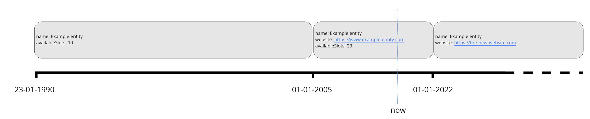
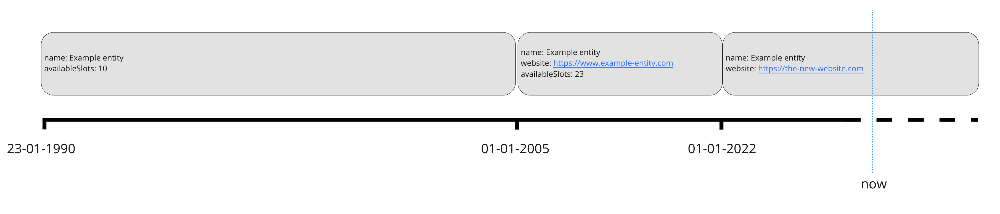

# Historical and future data

## timelineOverrides

OEAPI v6 provides a mechanism to communicate about data that were valid in
the past or will become valid in the future. An implementation is expected to
always return *the current value* of an entity as the main object in a
response. To specify historic and future changes, an implementation can add
one or more `timelineOverrides`.

Each timelineOverride is a repetition of the main object, but with attributes
that can have a different value or with absent optional attributes, indicating
that an attribute did not exist in the past or will not exist in the future.

A timelineOverride also specifies two date-time fields: `validFrom`
(inclusive) and `validTo` (exclusive), indicating for which period of time the
changed attributes are valid.

!> The timelineOverride mechanism is only available when requesting single
instances of either `Programme` or `Course`. In future versions of the OEAPI
specification, this mechanism might be added to other entities as well.

## Usage

The timelineOverride mechanism consists of the following:

1. A `returnTimelineOverrides` (boolean) query parameter that allows clients
   to specifically request the timelineOverride information. The default is
   `false`, so clients have to explicitly set this to `true` to obtain
   historical and future data.
2. A `timelineOverrides` attribute in the `Programme` and `Course` entities,
   which implementers can use to communicate historic and future versions of
   an entity.

## Example

In the following example, `name` is a required field and must therefore be
repeated in the timelineOverrides.



1. The first known state of events starts on 1990-01-23. The example entity
   has the following attributes:
   - name: Example entity
   - availableSlots: 10
2. From 2005-01-01 to 2022-01-01, which happens to also encompass the current
   moment, the Example entity has a website, and the number of available
   slots has grown to 23:
   - name: Example entity
   - website: [https://www.example-entity.com](https://www.example-entity.com)
   - availableSlots: 23
3. From 2022-01-01 onwards, it is not yet known when the state will change
   again, the information about the available slots has been dropped and the
   website has changed:
   - name: Example entity
   - website: [https://example-new-website.com](https://example-new-website.com)

This sequence of changes can be specified in OEAPI as follows:

```json
{
    "name": "Example entity",
    "website": "https://www.example-entity.com",
    "availableSlots": 23,
    "validFrom": "2005-01-01T00:00:00+01:00",
    "validTo": "2022-01-01T00:00:00+01:00",
    "timelineOverrides": [
        {
            "validFrom": "1990-01-23T00:00:00+01:00",
            "validTo": "2005-01-01T00:00:00+01:00",
            "entity": {
                "name": "Example entity",
                "availableSlots": 10
            }
        },
        {
            "validFrom": "2022-01-01T00:00:00+01:00",
            "entity": {
                "name": "Example entity",
                "website": "https://example-new-website.com"
            }
        }
    ]
}
```

### Later in time

Without changing the underlying data, let us look at the result at a later
point in time:



```json
{
    "name": "Example entity",
    "website": "https://the-new-website.com",
    "validFrom": "2022-01-01T00:00:00+01:00",
    "timelineOverrides": [
        {
            "validFrom": "1990-01-23T00:00:00+01:00",
            "validTo": "2005-01-01T00:00:00+01:00",
            "entity": {
                "name": "Example entity",
                "availableSlots": 10
            }
        },
        {
            "validFrom": "2005-01-01T00:00:00+01:00",
            "validTo": "2022-01-01T00:00:00+01:00",
            "entity": {
                "name": "Example entity",
                "website": "https://www.example-entity.com",
                "availableSlots": 23
            }
        }
    ]
}
```
