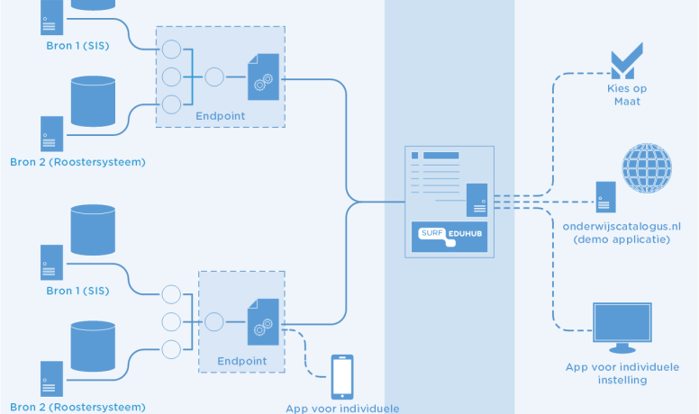

# Use cases and profiles

## Use cases

### OEAPI

Currently the OEAPI is implemented at universities of applied sciences and
universities for the RIO and EduXchange use case. MBO in the Netherlands also
implement the OEAPI for pilots like
[MBO OKE](https://github.com/NetwerkExamineringDigitalisering/NED-OOAPI).
More future OEAPI use cases will follow.

### RIO

The Open Education API (OEAPI) facilitates standardised data sharing among
Dutch educational institutions and other national systems, such as RIO
(Register Instellingen en Opleidingen), a registry managed by DUO. All Dutch
educational institutions are required to keep their data in this registry
current. Universities and universities of applied sciences utilise OEAPI for
this purpose. SURFeduhub reads the OEAPI endpoint on demand, translating the
institution’s data into a format that RIO can process, ensuring a streamlined
and consistent data flow between educational institutions and the national
registry, and making sure the data is always up to date and synchronised.
More information about the RIO functionality with OEAPI can be found in the
[RIO functionality documentation](https://servicedesk.surf.nl/wiki/spaces/WIKI/pages/198967389/RIO+Functionality).

### EduXchange

EduXchange is a platform that enables students to explore and enrol in
elective courses across universities, both within the Netherlands and across
Europe. Leveraging the Open Education API (OEAPI), EduXchange consolidates
course and minor offerings from participating institutions into a unified,
user-friendly platform. The enrolment process itself is facilitated by OEAPI
endpoints: personal data is securely retrieved from the student's home
institution via the OEAPI /persons endpoint. Once a course or minor is
completed, results are also communicated back to the home institution using
OEAPI calls, ensuring that academic records remain up to date across
institutions and borders. More information about EduXchange and OEAPI can be found in the
[EduXchange implementation documentation](https://wiki.surfnet.nl/display/EDX/Step+1.+Implementing+an+OOAPI+endpoint).

## Profiles

A profile is a formal document that defines a subset of OEAPI tailored for a specific use case or ecosystem. It specifies:

* Which endpoints are required to be implemented
* Which fields must be populated
* What validation rules apply

Examples of profiles include:

* [OKE](https://netwerkexamineringdigitalisering.github.io/NED-OOAPI/)
* eduXchange.eu

## Consumers

A consumer is an entity (an application, platform, or system) that consumes the OEAPI.
The specification lets any consumer attach extra attributes to standard OEAPI objects, beyond what the base specification defines.
In practice: you pass a `?consumer={name}` query parameter in the request, and the response includes a nested consumer-specific object with additional fields.

More information on consumers and profiles and a comparison between the two is available in the [technical documentation](/technical/consumers-and-profiles/)

## References

Currently the OEAPI is implemented at: universities of applied sciences,
universities and cross-sectoral. An example of the latter is a tool
implemented for the acceleration
[zone flexible education](https://www.versnellingsplan.nl/en/making-education-more-flexible/index.html).
Another example of such cross-sectoral implementations is the current
development of the RIO adapter and SURFeduhub.

