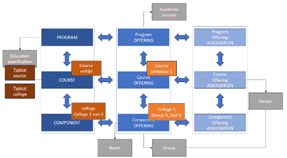

# Timetabling in the OOAPI Model

## Overview
This chapter explains how timetabling is implemented using the **OOAPI** model. It focuses on the relationships between **Programmes**, **Courses**, **Learning Components**, and their corresponding **Offerings**. It also demonstrates how multiple course instances (offerings) can exist within one academic year.



*Figure 1 – Relationship between education specifications (Programme, Course, Learning Component and Test Component) and their Offerings, including associations with AcademicSession, Room & Building, Group & Memberschip and Person.*

---

## 1. Conceptual Foundation
In the OOAPI model, the structure for teaching and scheduling is separated into two domains:

- **educationSpecifications** – defines *what* is being taught.
- **offerings** – defines *when, where, and how* it is taught.

This separation makes it possible to offer the same course multiple times (for instance, in different semesters) without duplicating its definition.

### Educational Specifications
| Entity | Description | Relation |
|---------|--------------|-----------|
| **Programme** | A collection of courses forming a study path or degree. | `hasPart` → multiple **Courses** |
| **Course** | A defined subject or unit of study. | `hasPart` → multiple **LearningComponents** and/or **TestComponents** |
| **LearningComponent** | A defined activity type such as a lecture, seminar, or lab. | Can related more than one course and may include other learning components. |
| **TestComponent** | A defined assessment, exam, or test. | Can related more than one course and may include other test components. |

Each of these has references to:
- `organisation` – the responsible institution or department.
- `parent` – the hierarchical relationship to the higher-level instance of the same object. For example, a learning component may have a parent learning component.

- `learningOutcome` – the expected outcomes connected to the object.

---

## 2. Offerings and Their Role in Timetabling
**Offerings** are the practical executions of educational specifications. They describe *when, where,* and *for whom* a course or learning activity takes place.

| Entity | Description | Relation |
|---------|--------------|-----------|
| **ProgrammeOffering** | The scheduled delivery of a **Programme**. |  Linked to its **Programme** and to multiple **CourseOfferings**. |
| **CourseOffering** | The scheduled delivery of a **Course**. | Linked to its **Course** and to one or more **ProgrammeOfferings**. |
| **LearningComponentOffering** | A scheduled instance of a **LearningComponent**. | Linked to its **LearningComponent** and to one or more **CourseOfferings**. |
| **TestComponentOffering** | A scheduled instance of a **TestComponent**. |  Linked to its **TestComponent** and  to one or more **CourseOfferings**. |

Each Offering refers to its conceptual parent (e.g. `course`, `learningComponent`) and connects to a specific `academicSession` (such as a semester or block).

---

## 3. Hierarchical Relationships

The OOAPI model distinguishes between **educational specifications** and their
**offerings**, while also supporting hierarchical structuring within each of these
domains. This chapter focuses on the hierarchical aspect of the model and describes
how programmes, courses, learning components, and test components can be organised,
together with their corresponding offerings.

The hierarchy described here reflects a *possible* structural organisation and is
intended for explanatory purposes only. It does **not** imply that all hierarchical
relationships are mandatory or universally applicable. In particular, a **Course**
does not necessarily form part of a **Programme** and may exist as a fully
self-contained educational specification.

The conceptual hierarchy and the hierarchy of offerings can be represented as follows:

```
Programme
 └── Course
      ├── LearningComponent (Lecture, Lab, Seminar)
      └── TestComponent (Final Exam)

ProgrammeOffering
 └── CourseOffering (linked to the above Course)
      ├── LearningComponentOffering (Lecture A)
      ├── LearningComponentOffering (Lecture B)
      ├── LearningComponentOffering (Lab Session)
      └── TestComponentOffering (Final Exam)
```

This representation illustrates hierarchical containment only. Each **Offering**
refers to its corresponding educational specification (for example, a
`courseOffering` refers to a `course`), but the diagram does not describe the full
set of conceptual or associative relationships between specifications and offerings.
In practice, associations such as enrolment, grouping, or participation are modelled
explicitly through association endpoints rather than through hierarchy.

The hierarchy shown above should therefore be understood as a structural aid, not as
a complete or normative model of all relationships within OOAPI. A relational,
left-to-right view of the associations between educational specifications, offerings,
and related entities would require a different form of representation, such as a
class diagram or an entity–relationship diagram (ERD).

---

## 4. Example: Course Offered Twice in a Year
This example follows the OOAPI v6 schemas for `ProgrammeOffering`, `CourseOffering`, `LearningComponentOffering` and `TestComponentOffering`. Objects are shown as separate resources, as they would be returned by their own endpoints.

### Conceptual Definition
**Course:** *Introduction to Data Science*  
**LearningComponents:**
- *Lecture Series*
- *Lab Sessions*
- *Final Exam*

### Example JSON
```json
[
  {
    "programmeOfferingId": "123e4567-e89b-12d3-a456-426614174000",
    "primaryCode": {
      "codeType": "programme_code",
      "code": "INF-2025"
    },
    "name": [
      {
        "language": "en-GB",
        "value": "BSc Informatics – 2025 cohort"
      }
    ],
    "academicSession": "2025Y",
    "programme": "987e6543-e21b-12d3-a456-426614174999"
  },
  {
    "courseOfferingId": "11111111-1111-1111-1111-111111111111",
    "primaryCode": {
      "codeType": "offering_code",
      "code": "INF-DS-2025S1"
    },
    "name": [
      {
        "language": "en-GB",
        "value": "Introduction to Data Science (Semester 1)"
      }
    ],
    "academicSession": "2025S1",
    "course": "22222222-2222-2222-2222-222222222222",
    "programmeOfferings": [
      "123e4567-e89b-12d3-a456-426614174000"
    ],
    "startDateTime": "2025-02-10T09:00:00+01:00",
    "endDateTime": "2025-06-15T23:59:59+02:00"
  },
  {
    "courseOfferingId": "33333333-3333-3333-3333-333333333333",
    "primaryCode": {
      "codeType": "offering_code",
      "code": "INF-DS-2025S2"
    },
    "name": [
      {
        "language": "en-GB",
        "value": "Introduction to Data Science (Semester 2)"
      }
    ],
    "academicSession": "2025S2",
    "course": "22222222-2222-2222-2222-222222222222",
    "programmeOfferings": [
      "123e4567-e89b-12d3-a456-426614174000"
    ],
    "startDateTime": "2025-09-10T09:00:00+02:00",
    "endDateTime": "2026-01-31T23:59:59+01:00"
  },
  {
    "learningComponentOfferingId": "44444444-4444-4444-4444-444444444444",
    "primaryCode": {
      "codeType": "offering_code",
      "code": "INF-DS-LEC-2025S1-A"
    },
    "name": [
      {
        "language": "en-GB",
        "value": "DS lecture group A (S1)"
      }
    ],
    "academicSession": "2025S1",
    "learningComponent": "55555555-5555-5555-5555-555555555555",
    "courseOfferings": [
      "11111111-1111-1111-1111-111111111111"
    ],
    "startDateTime": "2025-02-10T09:00:00+01:00",
    "endDateTime": "2025-02-10T11:00:00+01:00"
  },
  {
    "testComponentOfferingId": "66666666-6666-6666-6666-666666666666",
    "primaryCode": {
      "codeType": "offering_code",
      "code": "INF-DS-EXAM-2025S1"
    },
    "name": [
      {
        "language": "en-GB",
        "value": "Final exam Introduction to Data Science (S1)"
      }
    ],
    "academicSession": "2025S1",
    "testComponent": "77777777-7777-7777-7777-777777777777",
    "courseOfferings": [
      "11111111-1111-1111-1111-111111111111"
    ],
    "startDateTime": "2025-06-10T10:00:00+02:00",
    "endDateTime": "2025-06-10T12:00:00+02:00"
  }
]
```

In this example:
- The **ProgrammeOffering** represents the cohort of the Informatics programme in academic year `2025Y`.
- The **Course** *Introduction to Data Science* is offered twice, as two **CourseOfferings**, in `2025S1` and `2025S2`.
- Each **CourseOffering** refers back to the same conceptual **Course** via `course`, and to the same **ProgrammeOffering** via `programmeOfferings`.
- A **LearningComponentOffering** (lecture group A) is linked to the Semester 1 **CourseOffering** via `courseOfferings`.
- A **TestComponentOffering** (final exam) is also linked to the Semester 1 **CourseOffering** via `courseOfferings`.

---

## 5. Practical Notes for Implementers
- **ProgrammeOfferings** group all courses and their sessions within a defined academic period.
- **CourseOfferings** can exist multiple times per year (e.g. re-runs in different semesters) but always link back to the same conceptual **Course**.
- **LearningComponentOfferings** and **TestComponentOfferings** are the primary sources for generating time–room–group based timetables.
- The `programmeOfferings` and `courseOfferings` arrays implement the many-to-many relations between programmes, courses and components as modelled in OOAPI.
- **AcademicSessions** allow filtering events by semester, term, or block.
- **Organisation** and **Room** references (not shown in the JSON above) allow for integration with facility management and scheduling systems.

---

## 6. Summary
- **Courses** and **Programmes** define *what* is taught.
- **Offerings** define *when and where* teaching happens.
- A Course can have multiple Offerings in the same academic year, each with its own timetable.
- **LearningComponentOfferings** and **TestComponentOfferings** are the actual time-based entities for timetabling.
- Arrays like `programmeOfferings` and `courseOfferings` connect these objects according to the OOAPI v6 specification.

This model enables consistent, standardised integration of academic structure and scheduling, ensuring interoperability across timetabling, enrolment, and learning management systems.
